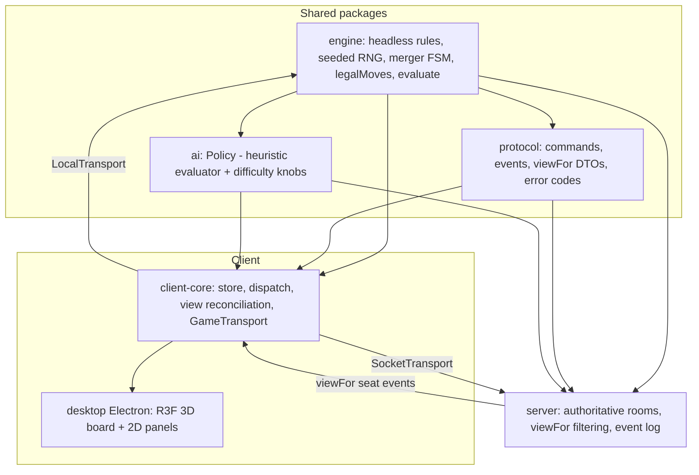
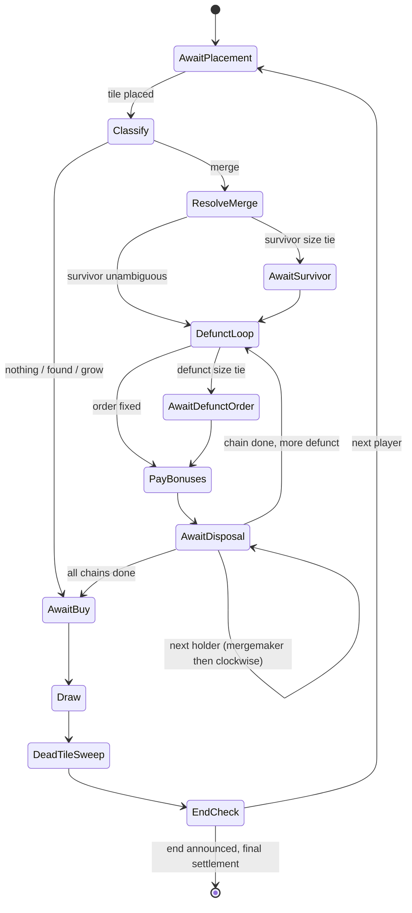
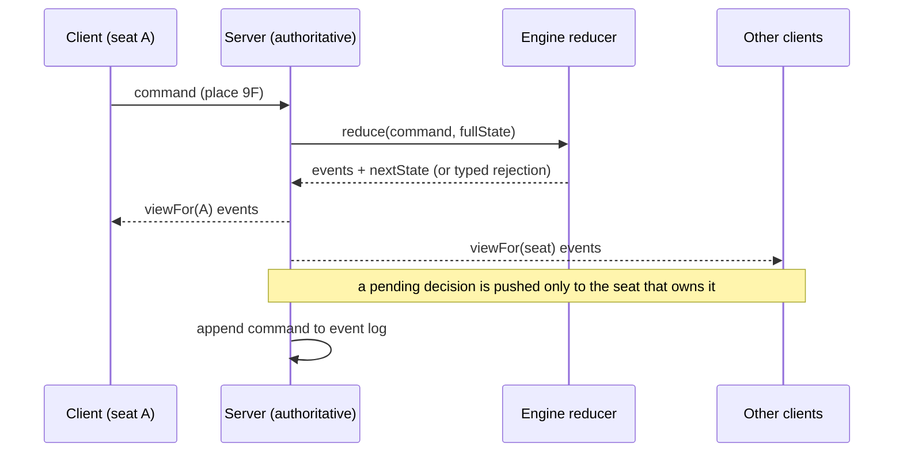

# Boomtown Architecture - Plan

## Goal Capsule

- **Objective:** People can play Boomtown — Acquire's mechanics, re-themed — as a desktop app, against each other locally, against bots, and online, with the full ruleset resolved correctly (both editions, and the sequenced merger).
- **Means:** One shared headless TypeScript engine, a deliberately basic 3D Electron client, non-LLM difficulty-scalable bots, and an authoritative server for room-code online play (KTD1, KTD8, KTD7, KTD6).
- **Authority hierarchy:** `docs/rules.md` and `docs/naming.md` are the rules authority. This plan owns architecture and sequencing. Within the plan, a Requirement wins on product behavior; a KTD wins on implementation mechanism inside its cited Rs.
- **Stop conditions:** Stop and surface if implementation uncovers a rules contradiction that `docs/rules.md` does not resolve, or if a session-settled decision (desktop-first, basic 3D, day-one non-LLM bot) proves infeasible.
- **Execution profile:** Phased. Each phase ends at a demoable state — offline hot-seat, then bots, then online, then packaged builds.
- **Tail ownership:** Standard `ce-work` tail (branch, tests, commits). No deploy tail — distribution is packaged desktop builds, addressed in U19.

---

## Product Contract

### Summary

Build Boomtown as a monorepo: a pure-logic game engine, a shared protocol package, a bot package, a client core, an Electron desktop app with a basic 3D board, and an authoritative multiplayer server. The engine is the single source of truth for rules, for the three play modes, and for the bots. Ruleset and merge-naming are data. Delivery is phased: prove the engine in an offline hot-seat desktop build, add bots, then layer online play, then package.

### Problem Frame

The design is complete and agreed across `docs/rules.md`, `docs/naming.md`, and `docs/decisions.md`. No application code exists. The next step is architecture.

Three constraints from `docs/decisions.md` shape everything:

- **Three play modes were chosen together** — local hot-seat, AI opponents, and online multiplayer. Online play forces an authoritative server because the tile bag and player hands are genuine hidden information. AI forces the engine to expose a clean legal-move list and a position evaluator.
- **Two published editions disagree** on safe size, end trigger, bonus tiers, and price bands. This is configuration, not a fork: one engine, edition as a data object, classic as default.
- **Merger resolution is the only genuinely sequenced part of the game.** Defunct chains resolve largest-first; per chain, bonuses then disposal in mergemaker-clockwise order; each fully resolved before the next. The placed tile never counts toward size, price, or bonus. Getting this wrong makes the rest moot.

The user has since fixed four directions: the Electron desktop app is the primary product (not a web app), the board renders in deliberately basic 3D, a simple non-LLM bot with a difficulty dial ships from day one, and online play is room-code based with no mandatory accounts.

### Requirements

#### Engine and rules

- R1. The engine implements the Boomtown turn: place a tile (one of nothing / found / grow / merge), optionally buy up to 3 shares across active corporations, draw back to 6, run the dead-tile sweep where the edition calls for it, and optionally announce the end. Placement is mandatory when any tile in hand is playable. See `docs/rules.md`.
- R2. The ruleset is data. One engine reads a `Ruleset` object. Classic and 2015 Avalon Hill ship as presets; classic is the default. Board geometry, safe size, end trigger, bonus tiers, price bands, sole-shareholder policy, dead-tile policy, two-player phantom-shareholder rule, and split rounding are all config keys, per the edition table in `docs/rules.md`.
- R3. Merger resolution follows the sequenced model in `docs/rules.md`: sizes are counted before the merging tile; the largest corporation survives and the mergemaker breaks a size tie; with three or more corporations every smaller one goes defunct at once; defunct corporations resolve one at a time, largest first, mergemaker breaking ordering ties; per defunct corporation, bonuses are paid, then stock is disposed (hold / sell at defunct price / trade 2-for-1 capped by the survivor's bank) mergemaker-first then clockwise; the headquarters returns to the tray; each defunct corporation is fully resolved before the next begins.
- R4. Bonus payouts read the price-and-bonus table as data. Primary is 10x the share price and tertiary (classic: minority) is 5x, but the 2015 secondary column is a printed lookup and ships as a table, not a formula. Tie handling (primary tie, secondary tie, tertiary tie, sole shareholder) follows the edition config.
- R5. Stock is finite — 25 shares per corporation, 175 total. An empty bank blocks share purchases, the founder's free share, and 2-for-1 trades alike. Active stock never converts to cash except through merger disposal or final settlement. A broke player still places and draws; there is no elimination.
- R6. A corporation has two names. `baseName` is identity and never changes — held defunct stock, refounding, and the board badge all key off it. `displayName` is derived: the stem plus one fragment for every corporation absorbed, in acquisition order, never stored. Merge-naming follows `docs/naming.md` and its config keys, including the assembled-name blocklist with a next-syllable fallback. A returned headquarters refounds under its base name.
- R7. The engine is deterministic given a seed. Every action is a command; the engine produces events and a new state; the ordered command log replays to an identical state. No wall-clock, no unseeded randomness, no reliance on map/object iteration order for game outcomes.
- R8. The engine exposes, for any state, the set of legal moves and a per-seat position evaluator. Neither depends on UI, network, or storage. The engine package runs standalone in Node and in a browser worker.
- R9. Final settlement pays bonuses for every active corporation as if it were merging, then the bank buys back all stock at current price. Stock in a corporation not on the board is worth nothing. The winner has the highest cash plus stock value; the engine reports the full ranking.

#### Play modes and clients

- R10. Local hot-seat supports 2–6 seats on one machine and runs fully offline in the desktop app, with no server process.
- R11. AI opponents are available in the first release. They use no LLM. They are driven by the engine's legal-move list and evaluator (R8). A single difficulty parameter scales strength up and down. Any mix of humans and bots is allowed at one table, including all-bot.
- R12. Online multiplayer uses an authoritative server that owns the hidden state (tile bag, player hands) and sends each client only its own filtered view. Games are joined by room code. A disconnected player can reconnect and resume their seat within the game.
- R13. Cash and holdings visibility is a per-table setting — hidden or open by agreement — not a rule. It applies in every mode.
- R14. The Electron desktop app is the primary deliverable. It packages for macOS, Windows, and Linux and presents the board in basic 3D.

#### Rendering

- R15. The board renders in basic 3D: an isometric or orthographic view of the 108-cell grid, extruded tile and headquarters meshes, and per-industry corporation colours. Readability is preferred over visual fidelity; there is no art-asset pipeline. The market, the hand rack, holdings and cash, and a merger-and-event log render as 2D UI.

### Key Decisions

- **Desktop app is the primary product.** The browser is not a v1 target. Governs R14. (session-settled: user-directed — chosen over a web-app-first build with Electron packaging on top: the user wants desktop as the primary product.)
- **Basic 3D board.** Governs R15. (session-settled: user-directed — chosen over a 2D DOM/SVG board: the user prefers a deliberately basic 3D build over the 2D direction the `docs/initial-design-doc.md` handoff and the design canvas assume.)
- **Non-LLM, difficulty-scalable bots from day one.** Governs R11. (session-settled: user-directed — chosen over deferring bots past v1 and over an LLM-backed bot: the user wants a simple bot that scales up or down, working from the first release.)
- **Room-code online play, no mandatory accounts.** Governs R12. (session-settled: user-approved — chosen over building accounts, lobby, and matchmaking now.)
- **Boomtown theme, not vanilla Acquire.** The re-themed corporations and merge-naming from `docs/naming.md` are the product; a `mergeNaming.enabled: false` config path keeps plain names available but is not a shipped mode. Governs R6.

### Success Criteria

- A full game of classic-edition Boomtown can be played start to finish in offline hot-seat with correct scoring, including at least one multi-corporation merger.
- The engine's characterization suite reproduces every worked example in `docs/rules.md` and the merge-naming lineage table in `docs/naming.md`.
- 10,000 random legal-move playouts complete without the engine throwing and each terminates with a ranked result.
- Over a large seeded sample, a higher bot difficulty setting beats a lower one materially more often than chance.
- In an online game, a payload capture shows no client ever receives another seat's hand tiles or the bag contents.
- Signed desktop builds launch on macOS, Windows, and Linux.

### Scope Boundaries

- **Outside this product's identity:** user accounts, authentication, ranked play, ELO, global leaderboards, public matchmaking, spectator mode, chat moderation, native mobile apps, a hosted web build, production hosting and horizontal scaling, trademark clearance of the corporation pool (a tracked open question in `docs/decisions.md`, not an engineering task).

#### Deferred to Follow-Up Work

- Asynchronous and persistent games (long-lived rooms, turn notifications) — the event-log substrate (KTD2) is chosen to make this addable without re-architecture.
- A stronger search-based bot policy (MCTS / POMCP as sketched in `docs/initial-design-doc.md`) behind the same `Policy` interface (KTD7).
- A replay / spectate viewer built on the event log.
- Tournament and table-rules presets beyond the two editions.
- Resolving the 2015 board dimensions (unspecified in that rulebook) if the 2015 preset is ever wanted for real play rather than rules parity.

### Sources

- `docs/rules.md` — reconciled rules model, edition config table, price/bonus table, invariants.
- `docs/naming.md` — corporation pool, merge-naming rules, config keys; `design/build.py` holds the reference implementation of `stem`, `fragment`, `_syls`, `display_name`, `game_lineage`.
- `docs/decisions.md` — settled decisions and the traps hit during design (2015 secondary column is not a formula; a naive syllable splitter returns whole words).
- `docs/initial-design-doc.md` — an earlier technical handoff. Its rules analysis and AI strategic postures are useful; its 3D-fidelity and stack recommendations are superseded by the session-settled decisions above.
- boardgame.io ([boardgame.io](https://boardgame.io/), [github.com/boardgameio/boardgame.io](https://github.com/boardgameio/boardgame.io)) and Colyseus ([colyseus.io/learn](https://docs.colyseus.io/learn)) — evaluated as the multiplayer substrate; see KTD1 and KTD6 for why the engine is custom.

---

## Planning Contract

### Key Technical Decisions

- KTD1. **Custom headless engine, not boardgame.io or a framework's game logic.** The engine is a pure-TypeScript package with no I/O. boardgame.io was the closest fit — turn-based, authoritative server, hidden state via `playerView`, generated bots — but its phase/stage model fights Boomtown's nested interruptible merger resolution (R3), and it couples game state to its own server and storage, which breaks the "engine is the source of truth for all three modes and the AI" constraint. boardgame.io and Colyseus patterns still inform the server (KTD6). Governs R1, R3, R8.
- KTD2. **Command/event model with a deterministic reducer and a seeded PRNG.** Every action is a typed command. The reducer validates it against state and returns events plus the next state, or a typed rejection. The ordered event log is both the persistence substrate and the replay/resync mechanism. A single seeded PRNG (a small PCG or xorshift, carried in state) is the only randomness. Governs R7.
- KTD3. **Merger resolution is an explicit, serializable state machine.** It yields typed pending-decision states — `choose-survivor`, `choose-defunct-order`, `dispose-shares` — each naming the seat that owns the decision. The turn loop suspends on a pending decision and resumes on the matching command. Hot-seat UI, bots, and the server all satisfy pending decisions through the same command interface. Governs R3.
- KTD4. **Public/secret state split with a `viewFor(seat)` projection.** State is `publicState` + `secretState` per seat (hand tiles) + `bag`. `viewFor(seat)` returns public state plus that seat's secret state plus counts (bag size, others' hand sizes), and applies the table's cash/holdings visibility setting. The server serializes only `viewFor(seat)` to each client. Governs R12, R13.
- KTD5. **`GameTransport` interface abstracts local and networked play.** `LocalTransport` runs the engine in-process (a renderer Web Worker). `SocketTransport` speaks to the server over WebSocket. `client-core` — store, dispatch, view reconciliation, pending-decision surfacing — is identical across both. Governs R10, R12, R14.
- KTD6. **Authoritative Node server: a minimal custom WebSocket layer, a room manager, and an append-only event-log store.** Colyseus was considered and rejected: its schema-sync assumes the server owns the state shape, which would re-couple the engine to the transport. The server imports the engine package, holds the authoritative state, reduces commands, and dispatches per-seat filtered events. The event log (SQLite, or JSON-lines for the simplest start) gives crash recovery and reconnection. Governs R12.
- KTD7. **Bots are a `Policy` interface over the engine's legal moves and evaluator.** The v1 policy is a weighted heuristic evaluation (stock-value delta, merger expected value with majority/minority awareness, early founding, endgame rush — the postures in `docs/initial-design-doc.md` section 5.3) with optional shallow lookahead and determinized sampling of hidden tiles. Difficulty scales three knobs: lookahead plies, determinization sample count (0 = pure heuristic), and a blunder rate. It runs off the main thread. A search-based policy can replace it behind the same interface. Governs R11. (session-settled: user-directed — chosen over deferring bots and over an LLM-backed bot: see the Key Decision.)
- KTD8. **Rendering: React + React Three Fiber, instanced meshes.** One instanced mesh for the 108-cell grid, extruded prisms for tiles and headquarters markers, per-industry colours, an orthographic isometric camera, raycast picking for placement. 2D React panels for market, hand, holdings, and log. No glTF assets, no texture pipeline. Governs R15. (session-settled: user-directed — chosen over a 2D board: see the Key Decision.)
- KTD9. **Electron hardening.** `contextIsolation` on, `nodeIntegration` off, a narrow preload bridge, Electron fuses enabled, a strict renderer CSP. Offline games run the engine in a renderer Web Worker; the main process owns window lifecycle and auto-update only. Governs R14.
- KTD10. **Merge-naming is ported from `design/build.py`, not reimplemented from prose.** Port `stem`, `fragment`, `_syls`, `display_name`, and the `game_lineage` replay into the `naming` module, then add the assembled-result blocklist check with a next-syllable-boundary fallback. `docs/decisions.md` records that prose reimplementation already failed once (whole-word fragments). Governs R6.
- KTD11. **Online identity is a per-seat session token, not an account.** Creating or joining a room mints a token; reconnection presents it. No password, no email, no persistence beyond the active game. Governs R12. (session-settled: user-approved — see the Key Decision.)
- KTD12. **Build sequencing: engine-first, offline hot-seat desktop build before any server.** Phase A delivers the engine; Phase B a fully offline hot-seat desktop app; Phase C bots; Phase D the server and online play; Phase E packaging. Governs the phase order below. (session-settled: user-approved — chosen over client-server from the first commit.)

### Assumptions

These are tooling defaults, not user-confirmed. An implementer may substitute an equivalent.

- Monorepo tooling: pnpm workspaces, TypeScript project references, Vitest for tests, electron-vite (Vite) for the desktop build, electron-builder for packaging.
- The event-log store starts as JSON-lines on disk and moves to SQLite (`better-sqlite3`) when reconnection and crash recovery land (U17); nothing above the store interface depends on which.
- WebSocket layer: the `ws` library on the server; the browser's native `WebSocket` in the client.
- Target OS versions are current macOS, Windows 10+, and a mainstream Linux desktop; no 32-bit builds.
- English-only UI; no internationalization framework in v1.
- The two-player phantom-shareholder rule (R2) is implemented in the engine but gets minimal dedicated UI in v1 — the bank's holdings surface in the market panel like any other holder.

### High-Level Technical Design

#### Package topology and data flow



The engine has no dependency on any other package. `protocol` depends only on engine types. `client-core` and `server` both depend on engine + protocol. `desktop` depends on client-core. Bots load in the client (local games) and in the server (online games).

#### Turn and merger state machine



Every `Await*` state is a pending decision that names an owning seat. `DefunctLoop`, `PayBonuses`, and non-tied transitions are automatic.

#### Online authoritative command flow



Local play runs the identical `reduce` call in a renderer worker via `LocalTransport`; there is no second code path for rules.

### Output Structure

```text
boomtown/
  package.json                 pnpm workspace root
  pnpm-workspace.yaml
  tsconfig.base.json
  packages/
    engine/
      src/
        ruleset/               types.ts, classic.ts, edition2015.ts
        pricing.ts             price/bonus bands and tables as data
        board.ts               1A-12I grid, adjacency
        rng.ts                 seeded PRNG carried in state
        state.ts               publicState, secretState, bag, viewFor
        commands.ts            typed command union
        events.ts              typed event union
        reducer/
          index.ts             reduce(command, state) -> events + state
          place.ts  buy.ts  draw.ts  deadTiles.ts
          merge/                survivor.ts, order.ts, bonuses.ts, disposal.ts, machine.ts
          endgame.ts  scoring.ts
        naming/                syls.ts, stem.ts, fragment.ts, displayName.ts, blocklist.ts
        queries/               legalMoves.ts, evaluate.ts
        index.ts
      test/                     characterization suites, property playouts
    protocol/
      src/                      messages.ts, dto.ts, errors.ts, version.ts
    ai/
      src/                      policy.ts, heuristic.ts, lookahead.ts, determinize.ts, difficulty.ts, worker.ts
      test/
    client-core/
      src/                      store.ts, dispatch.ts, reconcile.ts, transport/ (local.ts, socket.ts, types.ts)
      test/
    server/
      src/                      ws.ts, rooms.ts, session.ts, dispatch.ts, log/ (jsonl.ts, sqlite.ts, store.ts)
      test/
  apps/
    desktop/
      electron/                 main.ts, preload.ts, updater.ts
      src/
        board/                  Grid.tsx, Tiles.tsx, Markers.tsx, camera.ts, picking.ts
        panels/                 Market.tsx, HandRack.tsx, Holdings.tsx, EventLog.tsx, BuyControls.tsx
        decisions/              SurvivorPrompt.tsx, DefunctOrderPrompt.tsx, DisposalPrompt.tsx
        setup/                  NewGame.tsx, SeatConfig.tsx
        lobby/                  CreateJoin.tsx, SeatList.tsx
        engineWorker.ts
      electron-builder.yml
```

The per-unit **Files** lists are authoritative; this tree is the intended shape.

### Stakeholder and Impact Notes

- **Players** are the only external stakeholder. The load-bearing experience risks are merger correctness (a wrong payout is unrecoverable mid-game) and bot move latency.
- **Implementers** benefit from the engine being buildable and testable with zero UI or network — Phase A is fully verifiable on its own.
- **System-wide:** determinism is a cross-cutting invariant (R7). A single unseeded `Math.random`, `Date.now`, or order-dependent iteration anywhere under `packages/engine` or `packages/ai` breaks replay, reconnection, and bot reproducibility at once. It is enforced by lint and a CI replay check, not by convention.

---

## Implementation Units

### Unit Index

| U-ID | Title | Key files | Depends on |
|---|---|---|---|
| U1 | Monorepo scaffold and tooling | root config, `packages/*/package.json` | — |
| U2 | Ruleset config + price/bonus tables | `packages/engine/src/ruleset/`, `pricing.ts` | U1 |
| U3 | State model, board, seeded RNG, bag | `packages/engine/src/{board,rng,state}.ts`, `setup.ts` | U2 |
| U4 | Turn reducer: place / found / grow, buy, draw, dead tiles | `packages/engine/src/reducer/{place,buy,draw,deadTiles}.ts` | U3 |
| U5 | Merger resolution state machine | `packages/engine/src/reducer/merge/` | U4 |
| U6 | End trigger, final settlement, scoring | `packages/engine/src/reducer/endgame.ts`, `scoring.ts` | U5 |
| U7 | Merge-naming module ported from `build.py` | `packages/engine/src/naming/` | U2 |
| U8 | Legal-move enumeration + evaluator | `packages/engine/src/queries/` | U5, U7 |
| U9 | Electron shell (hardened) | `apps/desktop/electron/` | U1 |
| U10 | client-core: store, dispatch, reconcile, LocalTransport | `packages/client-core/src/` | U4, U9 |
| U11 | Basic 3D board (R3F) | `apps/desktop/src/board/` | U10 |
| U12 | 2D game panels | `apps/desktop/src/panels/` | U10 |
| U13 | Pending-decision UI | `apps/desktop/src/decisions/` | U5, U11, U12 |
| U20 | Local game-setup screen | `apps/desktop/src/setup/` | U10, U12 |
| U14 | Bot policy + difficulty | `packages/ai/src/` | U8, U10 |
| U15 | protocol package | `packages/protocol/src/` | U4 |
| U16 | Authoritative server | `packages/server/src/` | U15, U5 |
| U17 | Event-log persistence + reconnection | `packages/server/src/log/`, `session.ts` | U16 |
| U18 | SocketTransport + lobby UI | `packages/client-core/src/transport/socket.ts`, `apps/desktop/src/lobby/` | U16, U10 |
| U19 | Packaging, auto-update, settings | `apps/desktop/electron-builder.yml`, `updater.ts` | U13, U18 |

---

### Phase A — Engine

### U1. Monorepo scaffold and tooling

- **Goal:** A pnpm workspace with empty typed packages that build and test together.
- **Requirements:** Supports R8 (engine as a standalone package).
- **Dependencies:** none.
- **Files:** `package.json`, `pnpm-workspace.yaml`, `tsconfig.base.json`, `packages/{engine,protocol,ai,client-core,server}/package.json`, `packages/*/tsconfig.json`, `packages/*/src/index.ts`, `apps/desktop/package.json`, root `vitest.config.ts`, `.github/workflows/ci.yml`, `eslint.config.js`.
- **Approach:**
  1. pnpm workspaces; TypeScript project references so `engine` builds before its dependents.
  2. `engine`, `protocol`, `ai` target both Node and browser (no Node built-ins); `server` is Node-only; `desktop` is Electron.
  3. ESLint rule set that bans `Math.random`, `Date.now`, and `new Date()` under `packages/engine/**` and `packages/ai/**`.
  4. CI runs `pnpm -r build` then `pnpm -r test`.
- **Patterns to follow:** none in-repo; standard pnpm + project-references layout.
- **Test scenarios:** Test expectation: none — scaffolding. Verification is the smoke check below.
- **Verification:** `pnpm install`, `pnpm -r build`, and `pnpm -r test` all succeed on a clean checkout and in CI.

### U2. Ruleset config and price/bonus tables

- **Goal:** Both editions expressed as data, with a pricing function that reads them.
- **Requirements:** R2, R4.
- **Dependencies:** U1.
- **Files:** `packages/engine/src/ruleset/types.ts`, `ruleset/classic.ts`, `ruleset/edition2015.ts`, `packages/engine/src/pricing.ts`, `packages/engine/test/pricing.test.ts`.
- **Approach:**
  1. `Ruleset` type carries every key in the `docs/rules.md` edition table: `boardCols`, `boardRows`, `safeSize`, `endChainSize`, `bonusTiers`, `priceBands`, `soleHolderPolicy`, `deadTilePolicy`, `phantomShareholder`, `splitRounding`.
  2. Port `PRICE_ROWS`, `PRIMARY`, `SECOND2015`, `TERTIARY`, `BANDS_CLASSIC`, `BANDS_2015`, and the `band_index` / `row_index` / `price` functions from `design/build.py`.
  3. The 2015 secondary column is a literal array (KTD from `docs/decisions.md`), never computed.
  4. `classic` is exported as the default ruleset.
- **Patterns to follow:** `design/build.py` `band_index`, `row_index`, `price`.
- **Test scenarios:**
  - Classic band edges: size 10 and size 11 land in different bands; size 41 is the top band.
  - 2015 band edges: size 7 and size 8 differ; size 38 is the top band.
  - `price(size, tier, edition)` for a mid-table tier-2 corporation matches `docs/rules.md` for both editions.
  - Covers the `docs/rules.md` worked example: a five-tile tier-3 corporation pays 7,000 / 5,000 / 3,500 (2015 secondary from the lookup).
  - Classic primary is exactly 10x share price and minority is exactly 5x across every band.
  - Size below 2 yields no price (unincorporated).
- **Verification:** `pnpm --filter engine test` passes; every `docs/rules.md` table row is asserted.

### U3. State model, board, seeded RNG, bag

- **Goal:** An immutable game state, a board topology, deterministic setup.
- **Requirements:** R2, R5, R7.
- **Dependencies:** U2.
- **Files:** `packages/engine/src/board.ts`, `rng.ts`, `state.ts`, `setup.ts`, `packages/engine/test/{board,rng,setup}.test.ts`.
- **Approach:**
  1. `board.ts` builds the `1A`–`12I` grid from the ruleset dimensions and an orthogonal-adjacency function.
  2. `rng.ts` is a seeded PCG/xorshift whose state lives in the game state; every shuffle and draw goes through it.
  3. `state.ts` defines `GameState` = `{ ruleset, rng, publicState, secretState: Record<seat, SecretState>, bag }` and a `viewFor(state, seat)` projection returning public state, that seat's hand, and opaque counts, with the table visibility setting applied to cash/holdings.
  4. `setup.ts`: seat count 2–6, $6,000 starting cash, shuffle the bag, deal 6 tiles per seat, decide turn order, place the phantom shareholder when `phantomShareholder` is set.
- **Patterns to follow:** `design/build.py` `COLS`/`ROWS`, `cell_state`.
- **Test scenarios:**
  - Same seed and seat count produce an identical deal and turn order; a different seed does not.
  - Adjacency: corner cell has 2 neighbours, edge 3, interior 4.
  - The bag holds `cols*rows` tiles at setup minus what was dealt; drawing to empty is handled.
  - `viewFor(seat)` never includes another seat's hand array or the bag contents.
  - `viewFor` hides opponent cash and holdings when the table setting is "hidden" and shows them when "open".
  - Two-player setup with `phantomShareholder` creates the bank holder.
- **Verification:** `pnpm --filter engine test` passes; a serialized `viewFor` payload asserted to contain no secret keys.

### U4. Turn reducer — placement, buy, draw, dead tiles

- **Goal:** A working turn for every non-merge outcome.
- **Requirements:** R1, R5.
- **Dependencies:** U3.
- **Files:** `packages/engine/src/commands.ts`, `events.ts`, `reducer/index.ts`, `reducer/place.ts`, `reducer/buy.ts`, `reducer/draw.ts`, `reducer/deadTiles.ts`, `packages/engine/test/turn.test.ts`.
- **Approach:**
  1. `commands.ts` and `events.ts` define the typed unions. `reduce(command, state)` returns `{ events, state }` or a typed rejection.
  2. `place.ts` classifies a placement as nothing / found / grow / merge (merge dispatches to U5). Found: the seat picks a free headquarters, takes 1 free share if the bank has one, blocked (tile stays, not dead) when all 7 are in play. Grow: the corporation absorbs the tile and any unincorporated tiles it touches.
  3. `buy.ts`: up to 3 shares total across active corporations, capped by cash and by bank stock.
  4. `draw.ts`: refill to 6 while the bag has tiles.
  5. `deadTiles.ts`: when `deadTilePolicy` is set, discard permanently-dead tiles face up and replace; new dead tiles wait for the next turn.
- **Patterns to follow:** `docs/rules.md` "Turn" section; `design/build.py` `HAND` effect-kinds (`found`, `grow`, `merge`, `dead`, `none`).
- **Test scenarios:**
  - Placing an isolated tile is "nothing"; the turn proceeds to buy.
  - Founding takes the free share when available and takes nothing when the bank for that corporation is empty (R5).
  - Founding is blocked with all 7 headquarters in play: the tile stays in hand and is not marked dead.
  - Growing absorbs a chain of adjacent unincorporated tiles in one step.
  - Buy rejects a 4th share, a share the seat cannot afford, and a share when the bank is empty.
  - Draw refills to 6, and to fewer when the bag runs out.
  - 2015 dead-tile sweep discards a tile that would merge two safe corporations and draws a replacement; a replacement that is also dead is swept immediately.
  - A broke seat still places and draws.
  - Placement is required when any tile in hand is playable.
- **Verification:** `pnpm --filter engine test` passes; a scripted non-merge game runs to the end trigger.

### U5. Merger resolution state machine

- **Goal:** Correct, sequenced merger resolution — the crux of the game.
- **Requirements:** R3, R4.
- **Dependencies:** U4.
- **Files:** `packages/engine/src/reducer/merge/machine.ts`, `survivor.ts`, `order.ts`, `bonuses.ts`, `disposal.ts`, `packages/engine/test/merge/*.test.ts`.
- **Approach:** R3 owns the resolution rules; this unit builds the machine that executes them.
  1. `machine.ts` implements the state machine in the High-Level Technical Design: typed pending-decision states (`choose-survivor`, `choose-defunct-order`, `dispose-shares`), each naming the owning seat, suspending and resuming on the matching command.
  2. File mapping for the R3 steps: `survivor.ts` (survivor selection and size tie), `order.ts` (defunct ordering and tie), `bonuses.ts` (payout from the U2 table at pre-merger size, applying `soleHolderPolicy`, the edition tie rules, and `splitRounding`), `disposal.ts` (hold / sell / trade in mergemaker-then-clockwise order, trade capped by the survivor's bank).
  3. The placed tile is withheld from all size, price, and bonus math and joins the survivor only after the whole merger resolves.
  4. State is serializable at every pending decision, so a merger replays or resumes from the command log (R7).
  5. `place.ts` rejects any placement that would dissolve a safe corporation or merge two safe corporations (R3).
- **Patterns to follow:** `docs/rules.md` "Merger resolution" and "Bonus ties"; `design/build.py` `market()` for size/price/bonus derivation.
- **Test scenarios:**
  - The placed tile never counts toward either corporation's size, price, or bonus.
  - Equal-size two-corporation merger pauses for the mergemaker to choose the survivor.
  - A three-corporation merger defuncts both smaller chains and resolves the larger defunct one first; when the two defunct chains tie, the mergemaker chooses order.
  - Bonuses for each defunct chain are fully paid and disposed before the next chain begins.
  - Sole shareholder: classic pays both bonuses; 2015 pays primary + tertiary, not secondary.
  - Primary tie: 2015 combines primary + secondary, halves, rounds up to the nearest 100, and the next holder takes tertiary; classic combines primary + minority and halves.
  - Secondary tie and tertiary tie follow the edition rules in `docs/rules.md`.
  - Trade is capped by the survivor's remaining bank stock and is disabled at zero.
  - A safe corporation (size ≥ `safeSize`) cannot be dissolved; a tile touching two safe corporations is rejected as permanently dead.
  - Held stock in a defunct corporation persists; refounding that base name makes it live again.
  - With the two-player `phantomShareholder` rule active, the bank counts as a shareholder for bonus payouts and its holding is drawn per the edition rule.
  - Full merger resolution is deterministic and replayable from the command log (R7).
- **Verification:** `pnpm --filter engine test` passes; every worked merger example in `docs/rules.md` is reproduced by a test.
- **Execution note:** Build this unit test-first, one `docs/rules.md` example at a time. This is the unit where a silent error is unrecoverable in play.

### U6. End trigger, final settlement, scoring

- **Goal:** Games end correctly and produce a ranked result.
- **Requirements:** R2, R9.
- **Dependencies:** U5.
- **Files:** `packages/engine/src/reducer/endgame.ts`, `scoring.ts`, `packages/engine/test/endgame.test.ts`.
- **Approach:**
  1. `endgame.ts`: after buying, the active seat may announce the end when a condition holds — one corporation at `endChainSize`, or every active corporation safe. Announcing is never forced; the announcing seat finishes the turn.
  2. `scoring.ts`: on end, pay bonuses for every active corporation as if it were merging, then the bank buys back all stock at current price. Stock in a corporation not on the board is worth nothing.
  3. Report every seat's cash, equity, and total, ranked, with the tie rule from `docs/rules.md`.
- **Patterns to follow:** `docs/rules.md` "Invariants" — Final settlement.
- **Test scenarios:**
  - End is available at exactly `endChainSize` for the active edition (41 classic, 38 2015) and when all active corporations are safe.
  - A seat may decline to announce and keep playing.
  - The announcing seat completes buy and draw before the game ends.
  - Final settlement pays majority/minority for every active corporation at its current size.
  - Off-board (defunct, not refounded) stock scores zero.
  - Winner is the highest cash + equity; a tie is reported per the rule.
- **Verification:** `pnpm --filter engine test` passes; a full scripted classic game ends with a correct ranking.

### U7. Merge-naming module

- **Goal:** Derived display names that match the design reference exactly.
- **Requirements:** R6.
- **Dependencies:** U2.
- **Files:** `packages/engine/src/naming/syls.ts`, `stem.ts`, `fragment.ts`, `displayName.ts`, `blocklist.ts`, `packages/engine/test/naming.test.ts`.
- **Approach:** R6 owns the naming rules; this unit ports the reference implementation rather than rebuilding it from prose (KTD10).
  1. Port the `_syls`, `stem`, `fragment`, and `display_name` functions from `design/build.py` with their VCCV split, the 3–6 letter clamp, the one-character-word skip, and seam collapse.
  2. `displayName(baseName, eatenBaseNames[])` derives the name at read time; it is never stored.
  3. `blocklist.ts` checks the assembled result and, on a hit, falls back to the next syllable boundary — never to the unblended name.
- **Patterns to follow:** `design/build.py` `game_lineage()` — port its replay as a test fixture.
- **Test scenarios:**
  - Parity with the `docs/naming.md` lineage table: Megahit Video eats Pan-Atlas → `Megahitvilas`; Blackcurrant eats Enrun → `Blackcurrun`; the five-step endgame card reads `Megahitvilashutvenrun`.
  - A possessive one-character word (`Sizzle's`) contributes its previous syllable, not `s`.
  - A doubled letter at a fragment seam is collapsed.
  - The stem is taken once at founding and does not change as the corporation eats more.
  - A blocklisted assembled name falls back to the next syllable boundary.
  - A refounded corporation renders under its base name with an empty eaten list.
  - All 28 pool names produce a 3–6 letter fragment (none returns a whole word).
- **Verification:** `pnpm --filter engine test` passes; the ported `game_lineage` fixture matches `design/build.py` output.

### U8. Legal-move enumeration and evaluator

- **Goal:** The API the bots and the UI need.
- **Requirements:** R8, R11.
- **Dependencies:** U5, U7.
- **Files:** `packages/engine/src/queries/legalMoves.ts`, `evaluate.ts`, `packages/engine/test/queries.test.ts`.
- **Approach:**
  1. `legalMoves(state, seat)` returns every command the reducer would accept for the current state, including which pending decision is open and its legal options.
  2. `evaluate(state, seat)` returns a scalar position value: current net worth plus a weighted estimate of unrealized position (majority/minority exposure, chain growth potential, endgame proximity) — the postures in `docs/initial-design-doc.md` section 5.3.
  3. Both are pure and deterministic; `evaluate` takes no hidden information beyond `seat`'s own view.
- **Patterns to follow:** the reducer's own acceptance checks — `legalMoves` must not drift from `reduce`.
- **Test scenarios:**
  - For a representative set of states, every move in `legalMoves` is accepted by `reduce` and every rejected sample move is absent.
  - During a pending merger decision, `legalMoves` returns only that decision's options for the owning seat and nothing for others.
  - `evaluate` is deterministic for a fixed state and seat.
  - `evaluate` ranks an obviously winning position above an obviously losing one.
- **Verification:** `pnpm --filter engine test` passes; a fuzz test runs 10,000 random legal-move playouts to termination with no throw (Success Criteria).

---

### Phase B — Desktop shell and local play

### U9. Electron shell (hardened)

- **Goal:** A desktop window that loads the renderer securely.
- **Requirements:** R14.
- **Dependencies:** U1.
- **Files:** `apps/desktop/electron/main.ts`, `preload.ts`, `apps/desktop/electron-vite.config.ts`, `apps/desktop/index.html`, `apps/desktop/src/main.tsx`.
- **Approach:**
  1. `contextIsolation: true`, `nodeIntegration: false`, `sandbox: true`; a preload bridge exposing only a typed, minimal API (window controls, settings read/write, update check).
  2. Enable Electron fuses (no `run-as-node`, no remote module); set a strict CSP on the renderer.
  3. electron-vite builds main, preload, and renderer.
- **Patterns to follow:** current Electron security defaults; KTD9.
- **Test scenarios:** Test expectation: none — packaging/shell. Runtime smoke below.
- **Verification:** the app launches, the renderer loads, `window.require` and Node globals are undefined in the renderer, and the CSP has no `unsafe-eval`.

### U10. client-core: store, dispatch, reconciliation, LocalTransport

- **Goal:** One client state layer that works the same for local and networked play.
- **Requirements:** R7, R10, R13.
- **Dependencies:** U4, U9.
- **Files:** `packages/client-core/src/store.ts`, `dispatch.ts`, `reconcile.ts`, `transport/types.ts`, `transport/local.ts`, `apps/desktop/src/engineWorker.ts`, `packages/client-core/test/*.test.ts`.
- **Approach:**
  1. `GameTransport` interface: `send(command)`, `onEvents(cb)`, `connect`/`disconnect`.
  2. `LocalTransport` runs the engine in a Web Worker (`engineWorker.ts`) and applies `reduce` in-process, emitting `viewFor(seat)` events for every seat the machine controls (all seats in hot-seat).
  3. The store holds the current filtered view, the open pending decision, and an optimistic echo of the local command; `reconcile.ts` replaces the echo when authoritative events arrive and rolls back on rejection.
  4. Zustand for the store (per `docs/initial-design-doc.md`).
- **Patterns to follow:** none in-repo.
- **Test scenarios:**
  - A dispatched command produces an optimistic view update, then reconciles to the authoritative view.
  - A rejected command rolls the optimistic echo back and surfaces the typed error.
  - A pending decision from the engine appears in the store addressed to the owning seat.
  - `LocalTransport` round-trips a full non-merge turn.
  - The store applies the table visibility setting to what panels can read.
- **Verification:** `pnpm --filter client-core test` passes.

### U11. Basic 3D board (R3F)

- **Goal:** The board, in deliberately basic 3D, with tile placement by click.
- **Requirements:** R15.
- **Dependencies:** U10.
- **Files:** `apps/desktop/src/board/Grid.tsx`, `Tiles.tsx`, `Markers.tsx`, `camera.ts`, `picking.ts`, `apps/desktop/src/board/board.test.tsx`.
- **Approach:**
  1. One `InstancedMesh` for the 108 cells; extruded prisms for placed tiles and headquarters markers; per-industry colours from the pool data.
  2. Orthographic isometric camera; raycast picking maps a click to a cell and dispatches a placement command via client-core.
  3. Highlight legal placements for the active seat from `legalMoves`.
  4. No glTF, no textures — flat materials and vertex colours (KTD8).
- **Patterns to follow:** `design/build.py` `POOL` colours; the design canvas `Main.dc.html` for board proportions.
- **Test scenarios:**
  - Clicking an empty legal cell dispatches a place command for that tile.
  - Clicking an illegal cell dispatches nothing and shows why (blocked vs dead).
  - Board re-renders from a new view without leaking meshes (instance count stable).
  - Corporation colours match the industry mapping.
- **Verification:** interaction tests pass; a manual visual check shows a readable board at the default camera.

### U12. 2D game panels

- **Goal:** Everything that is not the board.
- **Requirements:** R1, R5, R13.
- **Dependencies:** U10.
- **Files:** `apps/desktop/src/panels/Market.tsx`, `HandRack.tsx`, `Holdings.tsx`, `EventLog.tsx`, `BuyControls.tsx`, `apps/desktop/src/panels/panels.test.tsx`.
- **Approach:**
  1. `Market.tsx`: one card per active corporation showing display name, size, price, bank stock, safe badge, and the accreted flavour — the design canvas card-consolidation model.
  2. `HandRack.tsx`: the seat's 6 tiles, each labelled with its effect (found / grow / merge / dead / none) from `legalMoves`; dead and blocked render differently.
  3. `Holdings.tsx`: the seat's cash and shares; opponents' cash and holdings only when the table setting is "open".
  4. `BuyControls.tsx`: pick up to 3 shares, disabled past the cash and bank caps.
  5. `EventLog.tsx`: a running list of events, expanded for merger steps.
- **Patterns to follow:** `design/build.py` `market()` fields; `Names.dc.html` / `Pool.dc.html` for card layout.
- **Test scenarios:**
  - The hand shows the correct effect label for each tile and distinguishes blocked from dead.
  - Buy controls reject a 4th share and any share past the cash or bank cap.
  - Opponent cash and holdings are hidden under the "hidden" table setting and shown under "open".
  - The market card shows the derived display name after a merger, not the base name.
  - The event log renders each step of a multi-corporation merger.
- **Verification:** `pnpm --filter desktop test` passes.

### U13. Pending-decision UI

- **Goal:** Humans resolve every merger decision the engine can raise.
- **Requirements:** R3.
- **Dependencies:** U5, U11, U12.
- **Files:** `apps/desktop/src/decisions/SurvivorPrompt.tsx`, `DefunctOrderPrompt.tsx`, `DisposalPrompt.tsx`, `apps/desktop/src/decisions/decisions.test.tsx`.
- **Approach:**
  1. Each prompt reads the open pending decision from the store and offers only its legal options (KTD3).
  2. `DisposalPrompt.tsx`: split holdings across hold / sell / trade; the split must sum to the holding; trade shows the 2-for-1 rate and the survivor's remaining bank cap and disables at zero.
  3. Prompts are modal for the owning seat and show a waiting state for others (hot-seat: pass the machine).
- **Patterns to follow:** `docs/rules.md` "Merger resolution" step 5.
- **Test scenarios:**
  - Covers R3. A size-tied merger shows the survivor prompt to the mergemaker with both corporations selectable.
  - A defunct-order tie shows the order prompt with the tied chains.
  - The disposal prompt rejects a split that does not sum to the holding.
  - Trade is disabled when the survivor's bank stock is zero and capped otherwise.
  - Resolving each prompt advances the machine to the next decision or to the buy step.
- **Verification:** `pnpm --filter desktop test` passes; a scripted hot-seat game plays a three-corporation merger end to end through the UI.

### U20. Local game-setup screen

- **Goal:** Start a local game with any mix of humans and bots.
- **Requirements:** R10, R11, R13.
- **Dependencies:** U10, U12.
- **Files:** `apps/desktop/src/setup/NewGame.tsx`, `SeatConfig.tsx`, `apps/desktop/src/setup/setup.test.tsx`.
- **Approach:**
  1. Pick seat count 2–6; per seat choose human or bot, and for a bot a difficulty (1–10 per KTD7).
  2. Choose the edition preset (classic default) and the table cash/holdings visibility setting (R13).
  3. On start, build the `Ruleset` and initial `setup` command and hand the game to `client-core` over `LocalTransport`.
  4. The bot-seat option is inert until U14 lands the `Policy`; wire the difficulty value through from the start.
- **Patterns to follow:** the `setup.ts` contract from U3; the settings shape from U19.
- **Test scenarios:**
  - A 3-human / 2-bot game starts with the chosen seat order and bot difficulties.
  - Seat count is clamped to 2–6.
  - The chosen edition and visibility setting reach the engine state.
  - An all-bot game can be started.
  - Starting a game with an unreachable seat config (0 humans and bots disabled) is blocked.
- **Verification:** `pnpm --filter desktop test` passes; a configured hot-seat game reaches the board.

---

### Phase C — AI

### U14. Bot policy and difficulty

- **Goal:** A non-LLM opponent that is functional from day one and scales.
- **Requirements:** R11.
- **Dependencies:** U8, U10.
- **Files:** `packages/ai/src/policy.ts`, `heuristic.ts`, `lookahead.ts`, `determinize.ts`, `difficulty.ts`, `worker.ts`, `packages/ai/test/*.test.ts`.
- **Approach:**
  1. `Policy` interface: `chooseMove(view, legalMoves, seat) -> command`, covering placements, buys, and every pending decision.
  2. `heuristic.ts`: weighted evaluation over `evaluate(state, seat)` plus move-specific terms — stock-value increase, merger expected value with majority/minority awareness, early founding of cheap chains, endgame rush when ahead (`docs/initial-design-doc.md` section 5.3).
  3. `determinize.ts`: sample the hidden tiles into opponents' hands and the bag, run `lookahead.ts` to a shallow depth, average. Sample count 0 = pure heuristic.
  4. `difficulty.ts`: one 1–10 parameter maps to lookahead plies, determinization sample count, and a blunder rate (probability of taking a non-top move).
  5. `worker.ts`: runs off the main thread (Web Worker locally, `worker_thread` on the server).
- **Patterns to follow:** KTD7; the `evaluate` contract from U8.
- **Test scenarios:**
  - The bot only ever emits a command present in `legalMoves` (fuzz over many seeded states).
  - The bot resolves every pending-decision type without stalling.
  - Difficulty monotonicity: over a large seeded sample of head-to-head games, difficulty 8 beats difficulty 3 materially more often than chance (Success Criteria).
  - A bot move is produced within the latency budget at the top difficulty.
  - Given a fixed seed and difficulty, the bot's moves are reproducible (R7).
  - An all-bot game runs to a ranked result.
- **Verification:** `pnpm --filter ai test` passes; the statistical difficulty harness runs in CI at a reduced sample and nightly at full sample.

---

### Phase D — Online multiplayer

### U15. protocol package

- **Goal:** One wire contract shared by client and server.
- **Requirements:** R12.
- **Dependencies:** U4.
- **Files:** `packages/protocol/src/messages.ts`, `dto.ts`, `errors.ts`, `version.ts`, `packages/protocol/test/roundtrip.test.ts`.
- **Approach:**
  1. Message envelopes: `command`, `events`, `pending-decision`, `error`, `room-state`, `hello`/`welcome`.
  2. `dto.ts`: the serialized shape of `viewFor(seat)` and of events; no engine-internal types cross the wire raw.
  3. `version.ts`: a protocol version in `hello`; a mismatch is rejected with a typed error.
- **Patterns to follow:** engine `events.ts` / `commands.ts` as the source types.
- **Test scenarios:**
  - Every message type serializes and deserializes to an equal value.
  - A `hello` with a wrong protocol version is rejected.
  - A `viewFor` DTO contains no secret field names.
- **Verification:** `pnpm --filter protocol test` passes.

### U16. Authoritative server

- **Goal:** The server owns the game; clients only see their view.
- **Requirements:** R12, R13.
- **Dependencies:** U15, U5.
- **Files:** `packages/server/src/ws.ts`, `rooms.ts`, `dispatch.ts`, `seats.ts`, `packages/server/test/*.test.ts`.
- **Approach:**
  1. `ws.ts`: a `ws` server; one connection maps to one seat in one room.
  2. `rooms.ts`: create a room (returns a code), join by code, assign seats, mark ready, start when full or on host start, close on empty.
  3. `dispatch.ts`: receive a command, reject it if it is out of turn or illegal per `reduce`, otherwise apply it and send `viewFor(seat)` events to each connected client; push a pending decision only to the owning seat.
  4. Bots for empty or bot seats run in `worker_thread`s (U14).
  5. Optional per-turn clock; on timeout the server plays a safe default or a bot move (config).
- **Patterns to follow:** boardgame.io's master/transport split and Colyseus's room lifecycle, reimplemented minimally (KTD6).
- **Test scenarios:**
  - An out-of-turn command is rejected without mutating state.
  - An illegal command is rejected with the engine's typed error.
  - Each client receives only its own `viewFor`; a captured payload for seat B contains none of seat A's hand tiles or the bag (Success Criteria).
  - A pending merger decision reaches only the owning seat.
  - Room lifecycle: create, join to full, reject an over-capacity join, close on last leave.
  - A bot seat plays its turns via a worker thread.
- **Verification:** `pnpm --filter server test` passes; an integration test runs a full 3-seat game (2 human sockets + 1 bot) to a ranked result.

### U17. Event-log persistence and reconnection

- **Goal:** A game survives a server restart and a client drop.
- **Requirements:** R12, R7.
- **Dependencies:** U16.
- **Files:** `packages/server/src/log/store.ts`, `log/jsonl.ts`, `log/sqlite.ts`, `session.ts`, `packages/server/test/recovery.test.ts`.
- **Approach:**
  1. `store.ts` is an append-only interface; `jsonl.ts` is the first implementation, `sqlite.ts` the durable one (Assumptions).
  2. Every accepted command is appended with its room, seat, and sequence number before events go out.
  3. On startup the server replays each room's log through `reduce` to reconstruct authoritative state (R7).
  4. `session.ts`: a per-seat token minted at join; reconnection within the game presents the token and receives the current `viewFor`.
- **Patterns to follow:** KTD2 — the event log is already the substrate.
- **Test scenarios:**
  - Killing and restarting the server replays the log to a deep-equal authoritative state.
  - A client that drops and reconnects with a valid token resumes its seat and receives the current view.
  - A reconnect with an unknown or wrong-room token is rejected.
  - A command is durably logged before its events are dispatched (crash between the two loses nothing).
  - The log replay produces the same state as the live run for a recorded game (cross-check with U8's fuzz playouts).
- **Verification:** `pnpm --filter server test` passes; a restart-mid-merger test resumes correctly.

### U18. SocketTransport and lobby UI

- **Goal:** The desktop app plays online through the same client-core.
- **Requirements:** R12, R14.
- **Dependencies:** U16, U10.
- **Files:** `packages/client-core/src/transport/socket.ts`, `apps/desktop/src/lobby/CreateJoin.tsx`, `SeatList.tsx`, `apps/desktop/src/lobby/lobby.test.tsx`.
- **Approach:**
  1. `socket.ts` implements `GameTransport` over `WebSocket`, with reconnect-and-resume using the session token and a keepalive ping.
  2. `CreateJoin.tsx`: host a room (show the code) or join with a code and a display name.
  3. `SeatList.tsx`: seats, ready state, bot seats, host start; a disconnect banner with auto-retry.
- **Patterns to follow:** the `LocalTransport` contract from U10 — the store must not tell the two apart.
- **Test scenarios:**
  - `SocketTransport` satisfies the same `GameTransport` contract tests as `LocalTransport`.
  - A dropped socket reconnects and the view is restored without a page reload.
  - Joining with a bad code shows a clear error.
  - The store behaves identically whether wired to `LocalTransport` or `SocketTransport` for a scripted turn.
- **Verification:** `pnpm --filter client-core test` and `pnpm --filter desktop test` pass; a manual two-instance game on one machine completes.

---

### Phase E — Packaging

### U19. Packaging, auto-update, settings

- **Goal:** Shippable desktop builds.
- **Requirements:** R13, R14.
- **Dependencies:** U13, U18.
- **Files:** `apps/desktop/electron-builder.yml`, `apps/desktop/electron/updater.ts`, `apps/desktop/src/panels/Settings.tsx`, `.github/workflows/release.yml`.
- **Approach:**
  1. electron-builder targets: macOS (dmg, arm64 + x64), Windows (nsis), Linux (AppImage).
  2. `updater.ts`: check an update feed on launch; download and prompt to restart.
  3. `Settings.tsx`: table cash/holdings visibility, default bot difficulty, edition preset (classic / 2015), seat count.
  4. Release workflow builds and signs on tag.
- **Patterns to follow:** electron-builder defaults; KTD9 fuses stay on in the packaged build.
- **Test scenarios:** Test expectation: none — packaging. Smoke checks below.
- **Verification:** signed builds launch on macOS, Windows, and Linux (Success Criteria); the update check runs on launch; settings persist across restarts.

---

## Verification Contract

| Gate | Command | Applies to |
|---|---|---|
| Type + build | `pnpm -r build` | all units |
| Unit + integration tests | `pnpm -r test` | all units |
| Engine rules parity | `pnpm --filter engine test` | U2–U8 — must reproduce every `docs/rules.md` worked example and the `docs/naming.md` lineage table |
| Determinism replay | engine + server replay check in CI | U3, U5, U16, U17 |
| Property playouts | 10,000 random legal-move games terminate with no throw | U8 |
| Bot difficulty harness | `pnpm --filter ai test` (reduced in CI, full nightly) | U14 |
| Hidden-state leak check | payload assertion in server integration tests | U16, U17 |
| Desktop smoke | `pnpm --filter desktop dev` boots; renderer has no Node globals | U9, U11–U13 |
| Packaging smoke | signed builds launch on the three OSes | U19 |

No repo test commands exist yet; U1 establishes `pnpm -r test` and CI. There is no `release:validate` — release verification is the packaging smoke in U19.

---

## Definition of Done

**Global:**

- Every Requirement R1–R15 is met by at least one unit and its tests.
- The engine reproduces every worked example in `docs/rules.md` and the merge-naming lineage in `docs/naming.md`.
- A full classic-edition game plays start to finish in offline hot-seat, in a vs-bot game, and in an online 3-seat game, each ending with a correct ranking.
- The determinism replay gate and the hidden-state leak check pass in CI.
- Signed desktop builds launch on macOS, Windows, and Linux.
- No dead-end or experimental code from abandoned approaches remains in the tree; the `Math.random` / `Date.now` lint gate is green.
- `docs/decisions.md` open questions that this work resolved (or newly raised) are updated.

**Per unit:** the unit's Verification line holds and its test scenarios are covered by real tests (not annotations), except units explicitly marked `Test expectation: none`.

---

## Risks & Mitigations

- **Merger resolution is the highest-risk area.** A wrong payout or ordering is unrecoverable mid-game. Mitigation: U5 is built test-first, one `docs/rules.md` example at a time; property playouts (U8) exercise it at volume; the state machine is serializable so any failure is reproducible from the command log.
- **Determinism leaks.** A single `Math.random`, `Date.now`, or order-dependent iteration under `engine`/`ai` silently breaks replay, reconnection, and bot reproducibility. Mitigation: lint gate (U1), seeded PRNG in state (U3), CI replay check (U17).
- **3D scope creep and performance.** 108 instanced cells plus picking plus overlays can regress on low-end GPUs, and "basic 3D" can drift toward asset work. Mitigation: KTD8 fixes the technique (instancing, flat materials, no assets); a frame-time budget is part of U11's manual check.
- **Bot strength and difficulty tuning are playtest-driven.** Mitigation: difficulty is three exposed knobs (U14), not a black box; the statistical harness catches regressions; a stronger policy is a deferred drop-in behind `Policy`.
- **Reimplementing matchmaking and persistence** (the cost of not using boardgame.io). Mitigation: scope is deliberately small — room codes, session tokens, an append-only log — and the event-log substrate was already needed for replay.
- **Electron security misconfiguration.** Mitigation: KTD9 (context isolation, fuses, CSP), asserted in U9's verification and kept in the packaged build (U19).
- **Hidden-state leak in online views.** Mitigation: the server serializes only `viewFor(seat)` (KTD4); U16/U17 assert no secret keys in any non-owner payload.

---

## Alternative Approaches Considered

- **boardgame.io as the engine and server.** Fastest path to online turn-based play with generated bots and matchmaking. Rejected: its phase/stage model does not express Boomtown's nested interruptible merger resolution cleanly, and it couples game state to its own server/storage, which conflicts with the engine being the shared source of truth for hot-seat, bots, and online alike. Its patterns still inform KTD6.
- **Colyseus as the multiplayer substrate.** Strong room lifecycle and state sync. Rejected as the primary substrate: schema-sync assumes the server owns the state shape, re-coupling the engine to the transport. A minimal custom WebSocket layer keeps the engine transport-agnostic; Colyseus's room model is the reference for U16.
- **2D board (DOM/SVG or 2D canvas).** Simpler, lighter, and the direction the design canvas and `docs/initial-design-doc.md` assume. Not chosen — the user prefers a deliberately basic 3D build (Key Decision).
- **Web-app-first with Electron packaging on top.** Would make a hosted browser build cheap later. Not chosen — desktop is the primary product (Key Decision); the browser build is a deferred possibility, and the `GameTransport` split (KTD5) keeps it reachable.
- **Client-server from the first commit.** Avoids a later transport-integration step. Not chosen — proving the engine in a fully offline hot-seat build first (KTD12) de-risks the crux (merger resolution) before any network complexity.
