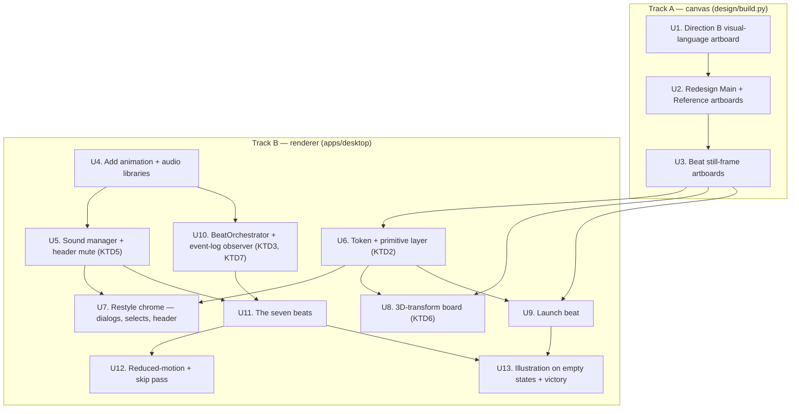
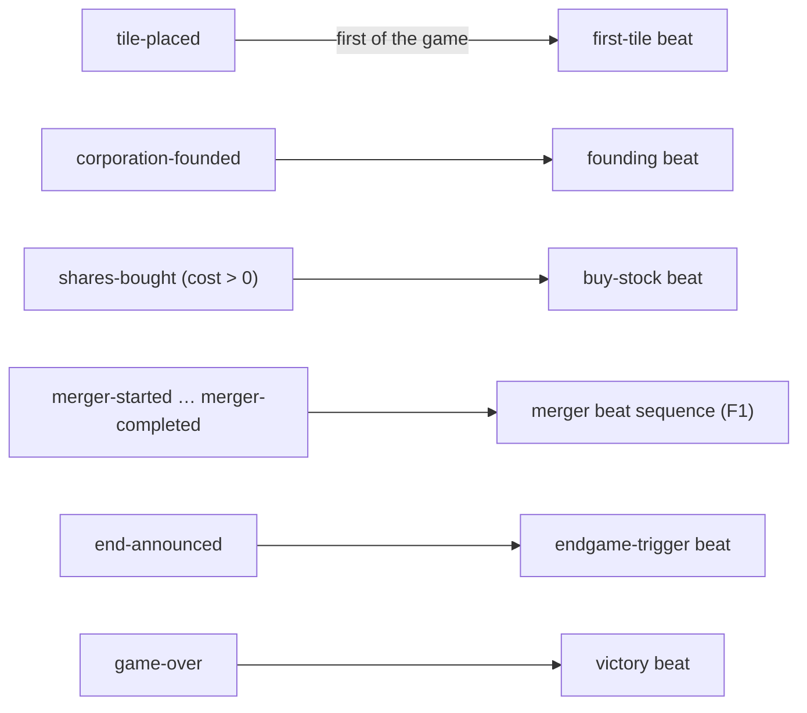

# Game-Feel Presentation Overhaul - Plan

## Goal Capsule

- **Objective:** Someone who opens Boomtown reads it as a premium digital board game, not a web app — at rest and across its key moments.
- **Means:** A crafted visual language established on the redesigned canvas artboards and carried through the renderer, plus seven game-moments each choreographed as a full beat (KTD1, KTD2).
- **Product authority:** This plan owns the desktop app's presentation layer (`apps/desktop` renderer) and the design canvas (`design/build.py` artboards). Game rules, the engine, and the online/AI architecture are not active scope.
- **Execution profile:** Deep. Cross-cutting across every screen plus the canvas generator. Styling and choreography work — the first proof is smoke and visual verification, not new unit suites.
- **Stop conditions:** Stop if the beat observer cannot be built without engine changes (KTD3) — that would breach the presentation-only boundary and needs a return to `ce-brainstorm`.
- **Tail ownership:** The implementer runs the Verification Contract. Do not push or open a PR — the user has stood down auto-push for this session.

## Product Contract

_Product Contract preservation: restructured, no scope change. R6 expanded — R6 keeps the "each moment is a deliberate beat" intent and its moment list grows from six to seven (buying stock added, per the user in planning); no requirement IDs moved. R9 and R10 forks resolved into KTD5 and KTD6 and the requirement text updated to state the resolved intent. `Covers`/`Governs` links unchanged._

### Summary

Re-dress the desktop presentation to feel like a modern premium board-game adaptation (the Ticket to Ride / Wingspan digital tier — warm, tactile, atmospheric, but not scanned cardboard). Two intertwined halves, delivered as one body of work: a crafted visual language established on the redesigned canvas artboards and carried through every renderer screen, and seven game-moments — launch, first tile, founding, buying stock, merger, endgame trigger, victory — each choreographed as a full beat with visual, motion, sound, and copy. The current palette and typefaces stay as anchors; every other treatment is pushed well past today's flat rectangles.

### Problem Frame

The app is competently built but reads as a well-made SaaS product. The user's assessment is that it is "all of it — the whole vibe": nothing single is wrong, the sum is a dashboard. The visible causes: flat cards with 1px borders and small radii, a spreadsheet-like grid board, Radix dialogs and native `<select>` chrome, and near-total absence of motion, depth, texture, atmosphere, or sound. State changes snap. A merger — the dramatic core of the game — resolves as a modal appearing and a table updating.

The design canvas deliberately chose the "Saxon City" direction (clean, editorial, the corporations as subject) over a literal board-game look and a trading-terminal look (`docs/decisions.md`). That choice stands. The gap is that the direction was never taken far enough to stop feeling like a tool — it has the clean bones but none of the weight, craft, or ceremony that makes a digital board game feel like a game.

### Requirements

**Visual language (the crafted system)**

- R1. A redesigned visual language is established on the `design/build.py` Direction B artboards covering: surface treatment (texture, paper, depth), an elevation and lighting model, panel framing, the corporation-card treatment, the board treatment, typographic hierarchy beyond the current two-role split, and an illustration approach. The artboards are the visual spec the renderer implements against.
- R2. The palette tokens (`--bg: #faf6f0`, `--surface: #ffffff`, `--accent: #b3462f`, the muted-brown ink and rule tokens in `apps/desktop/src/styles/global.css`) and the typefaces (DM Sans body, DM Serif Display display) are retained as anchors. The visual language builds on them; it does not replace them.
- R3. The visual language is not skeuomorphic: no felt, wood-grain, plastic-token, or scanned-paper textures, and no board pieces styled to mimic physical objects. Warmth and depth come from lighting, shadow, illustration, framing, and motion — not material mimicry.
- R4. The everyday between-moments screen (the board plus side panels during an ordinary turn) receives the full visual-language treatment. It does not stay in its current flat state while only the big moments are dressed.
- R5. The web-app chrome is restyled so it does not read as web-app parts: dialogs, dropdowns, buttons, and the header bar get treatments consistent with the visual language rather than default component-library or form styling.
- R13. Illustration is light and its surfaces are fixed: the launch screen, the victory beat, and exactly three empty states — the "no corporations founded yet" band, the "no moves yet" story feed, and the "nothing in the tray" strip. It is produced as static AI-generated assets to a written style brief. Corporation identity keeps its existing icon marks. Adding an illustration surface beyond these five is out of scope for this plan.

**Choreographed moments**

- R6. Seven game-moments each receive a deliberate treatment that reads as a game beat rather than a state change: application launch, the first tile placed in a game, founding a corporation, buying stock, a merger resolving, the endgame trigger firing, and victory / final settlement.
- R7. Each moment's treatment specifies its visual still-frame (on the canvas where the moment is canvas-representable), its motion (entrance, hold, exit, and timing), its sound, and its on-screen copy.
- R8. Motion respects `prefers-reduced-motion` and never blocks or slows play beyond a bounded hold — a hot-seat game with an impatient table stays fast. Where a beat has a hold, it is skippable by a click or key press.
- R14. A beat plays only for an engine event that arrives live during the session — one appended to `state.log` after the beat orchestrator mounts — not for events already present at mount. The condition for each beat is checked against the projected view (turn count, tiles on the board, corporation state), not a `state.log` index, so it is correct whether the log is complete (hot-seat, vs-AI) or partial (an online client that reconnected mid-game).

**Sound**

- R9. Sound plays for the seven moments in R6 and for placing a tile. Sound is on by default. A mute control is always visible in the game header, and its state persists across sessions.

**Board treatment**

- R10. The board keeps its DOM grid and gains dimensionality through CSS 3D transforms: a slight perspective tilt and real tile thickness, consistent with the visual language's lighting model. No `<canvas>` layer and no WebGL. The board is one element of the visual language, not the centerpiece.

**Delivery**

- R11. The canvas half is delivered by editing `design/build.py`, running `cd design && python3 build.py`, and republishing via the design skill, keeping `design/boomtown.html` as the file path so the artifact URL is preserved (per `CLAUDE.md`). The redesigned Direction B artboards replace the current ones; the rejected Direction A ("Board Room") artboard is left untouched.
- R12. The motion, sound, and timing specifications — which a static artboard cannot carry — are captured in this plan's Implementation Units and its High-Level Technical Design, alongside the canvas work, as one coherent body of work.

### Key Decisions

- KTD1 is governed by this. **Both a visual system and per-moment choreography, not one or the other** (session-settled: user-directed — chosen over "visual language only" and over "moments-first only": the everyday screen and the big beats both need to land, and the user accepted the larger scope). Governs R1, R4, R6.
- **Palette and typefaces anchored; everything else pushed hard** (session-settled: user-directed — chosen over keeping the current clean treatment as-is and over rethinking the visual identity entirely: "somewhere between" — a heavier, more crafted version of the same idea). Governs R2.
- **Target reference is the modern premium board-game app tier** (session-settled: user-directed — chosen over period-authentic 1920s–30s, over restrained-and-heavy strategy-title, and over a free-text description: Ticket to Ride / Wingspan digital — warm, tactile, animated, atmospheric, still a designed digital product). Governs R3.
- **The 2D CSS grid board decision is reopened for this work** (session-settled: user-directed — chosen over treating the flat grid as a fixed constraint: depth on the board is allowed to sell the feeling). Reverses the "fixed" status of the board-rendering row in `docs/decisions.md` for this effort. KTD6 makes the resolved how-level choice. Governs R10.
- **Bundle "ships no node_modules" discipline flexes where it earns the payoff** (session-settled: user-approved — the user was shown the trade-off against the recent React Three Fiber removal and the electron-vite bundling model, and accepted spending weight on illustration assets, a sound library, and an animation library where they earn it). Governs R9, R10, R13.
- **Success is judged moment by moment** (session-settled: user-directed — chosen over a playtester gut check, an obvious before/after, and "the canvas convinces first": each moment gets a deliberate treatment and is judged individually as landing as a game beat). Governs R6, and see Success Criteria.

### Key Flows

- F1. Merger beat (the load-bearing moment)
  - **Trigger:** A tile placement connects two or more corporations and the engine begins merger resolution (`merger-started` in the event log).
  - **Actors:** The mergemaker, the other shareholders, and (in hot-seat) whoever is at the machine.
  - **Steps:** The board reads the merge as an event, not a quiet cell change. The renamed survivor is presented as a beat — the two names collide into the accreted name, the card widens. Bonuses are paid with weight. Disposal proceeds per player. Control returns to the mergemaker for the buy step. Each stage has motion, a bounded hold, and sound; the whole sequence is skippable per R8.
  - **Covers R6, R7, R8, R9.**
- F2. Launch beat
  - **Trigger:** The application opens to the main menu.
  - **Steps:** The first thing seen sets a tone rather than presenting a form — the wordmark logo, illustration, atmosphere. The menu is part of the visual language, not a plain button stack.
  - **Covers R6, R7, R13.**
- F3. Ordinary turn (the between-moments baseline)
  - **Trigger:** It is a local player's turn and no beat is firing.
  - **Steps:** The board, the corporation band, the shareholders panel, the tile rack, and the action bar are all rendered in the crafted visual language. Placing a tile has tactile feedback (motion and sound) even though it is not one of the seven named beats.
  - **Covers R4, R5, R9.**

### Acceptance Examples

- AE1. **Covers R3.** Given the redesigned board, when a reviewer inspects it, then it has visible depth and lighting but no wood-grain, felt, or faux-plastic-tile texture, and no cell is styled to look like a physical tile token.
- AE2. **Covers R4.** Given a game mid-turn with no beat firing, when compared side by side with the current build, then the everyday screen is visibly part of the same crafted system as the beats — not the current flat cards.
- AE3. **Covers R6, R7.** Given each of the seven moments, when it fires, then a viewer who was not told what changed can identify it as a deliberate game beat rather than a screen updating.
- AE4. **Covers R8.** Given `prefers-reduced-motion` is set, when any beat fires, then its motion is reduced or removed and the beat still communicates through its still-frame, copy, and sound. Given motion is on, when a beat has a hold, then a click or key advances past it.
- AE5. **Covers R2.** Given the redesigned artboards, when the palette and type are sampled, then `--bg`, `--accent`, DM Sans, and DM Serif Display are still the anchors — the change is treatment, not identity.
- AE6. **Covers R11.** Given the canvas work is done, when `cd design && python3 build.py` runs and the design skill republishes, then `design/boomtown.html` is the file path and the artifact URL is unchanged.
- AE7. **Covers R9.** Given a new install, when the app first plays a beat, then sound is audible. Given the user clicks the header mute control and restarts the app, then sound stays muted.
- AE8. **Covers R14.** Given the beat orchestrator mounts on a game already in progress, when it records the hydration mark, then no beat plays for the events present at mount. Given the next event is appended live, then its trigger runs. Given an online client that reconnected at turn 20 with a short `state.log`, when a live `tile-placed` arrives, then the first-tile beat does not fire because the view shows twenty-plus tiles on the board — the trigger reads the view, not the log index.

### Success Criteria

- Each of the seven moments in R6 has a treatment that the user and a small number of playtesters independently read as a game beat, judged one moment at a time.
- The everyday screen (F3) is judged part of the same crafted system as the beats, not a flat baseline the beats sit on top of.
- The redesigned artboards are a sufficient visual spec: an implementer can build the renderer treatment from them without inventing the visual language.
- The reference tier lands: a viewer familiar with premium board-game apps places Boomtown in that category, not in "web tool."
- The renderer bundle grows by no more than 120 KB gzipped over the baseline U4 records before adding either library; illustration assets are sized and compressed for a desktop app.

### Scope Boundaries

- Game rules, the engine, merger sequencing logic, the online substrate (PartyKit), and the AI opponents are out of scope. This is presentation only; no mechanic changes.
- No new screens or features: no replay viewer, no spectator mode, no profile / stats / achievements. This re-dresses what exists.
- The design canvas's content decisions — the 28-company pool, the naming and accretion rules, the card-consolidation idea, the ruleset-driven reference table — stay. Only their visual treatment changes.
- Finished art production is out of scope. The plan defines the illustration style brief and the integration points; producing a large commissioned art set is separate downstream work.
- Marketing site, store listing assets, and the OS app icon are out of scope. This is the in-app experience.
- The rejected Direction A ("Board Room") artboard in `design/build.py` is not redesigned.

#### Deferred to Follow-Up Work

- A dedicated first-run onboarding sequence. The launch beat sets a tone; a full tutorial or guided first game is separate.
- Per-corporation illustrated emblems replacing the icon marks. The brainstorm considered this and the user chose to keep icon marks for now.
- Sound design polish beyond a working first set — layered ambience, music, per-industry audio identity.

### Dependencies / Assumptions

- The seven-moment list (launch, first tile, founding, buying stock, merger, endgame trigger, victory) is confirmed scope as of planning.
- The redesigned artboards replace the current Direction B canvas and republish to the same URL per `CLAUDE.md`'s design-canvas workflow.
- "Flexes for the right payoff" (bundle budget) means deliberate, justified additions. Each added asset or library earns its weight against a named beat or treatment, within the ~120 KB ceiling in Success Criteria.
- The design skill is available in the session that does the canvas work (it built the current canvas; `CLAUDE.md` references it). If it is not, the canvas units still produce the `design/build.py` edits and the regenerated `.dc.html` files; only the republish step waits.
- The engine emits a typed `EngineEvent` log (`packages/engine/src/events.ts`); the client store keeps it at `state.log` and also holds the projected view. The beat observer uses the log only to separate live appends from hydrated events, and evaluates beat conditions against the view. No engine change is needed.
- `packages/client-core/src/reconcile.ts` appends to `state.log` and never replaces it; `packages/server/src/room.ts` sends `events: []` on resume. This is why the beat observer keys off the view, not a log index (KTD3, R14).

### Outstanding Questions

**Resolve Before Planning**

- None.

**Deferred to Implementation**

- The exact animation library (Motion / a Framer-Motion-class package) and audio library (a Howler-class package) — pick during U4 against the bundle ceiling and React 19 compatibility. The document review noted that the app has one animated component today and beats are the simplest animation shape; if U4's evaluation shows the hand-rolled cost is small, starting with the Web Animations API and adopting a library only past a named complexity threshold is a defensible inversion of the current fallback.
- The precise perspective angle, tile thickness, and shadow depth for the 3D board — tuned during U8 against the redesigned board artboard.
- The concrete illustration style — subject (skyline vs figures vs abstract), figurative-vs-abstract, its relationship to the "Saxon City" editorial direction, and 2–3 reference works — is written into the style brief in U1, then refined in U9. Not left to invent at U9.

**Resolve during U10 / U11 (raised by document review, not blocking)**

- **Merger beat versus the existing merger UI (F1, U11).** During a merger the decision modal renders interactive survivor / disposal prompts and the story card runs a persistent in-panel narration that stays visible through the per-player disposal phase. U11 must map each F1 stage to a concrete UI state: which stages are passive overlays played between prompts (name collision, bonus payout), and which are a crafted restyle of the existing prompts (survivor pick, disposal). "Supersede the story-card animation" needs a decision — remove that branch and let the beat carry both the climax and the persistent narration, or keep the branch for the resolution phase and let the beat handle only the climax. The story-card merger branch is roughly two-thirds of the component and recently curated, so this is not a small reconcile.
- **Buy-stock beat versus the buy modal (R6, U11).** U10 fixes the trigger (fires once per turn, only when `cost > 0`). U11 still needs to decide whether the beat renders as an in-place flourish on the holdings or an overlay over the buy modal, and whether it plays at all — or at reduced intensity — for a non-local seat's purchase.
- **Beats for non-local actors (U10).** In vs-AI and online play, founding, buying, and merger events for bot and remote seats arrive live. U10 must state which of the seven beats play for a non-local actor (likely the table-level ones — founding, merger, endgame, victory — at full intensity, and buy-stock / first-tile only for the local player or as a reduced flourish).
- **Launch-beat cross-cutting concerns (U11, U12).** The launch beat is App-level and shares none of the orchestrator's plumbing. U11 must name which unit owns its reduced-motion path, its skippable hold, and its sound, since U12's audit is scoped to the orchestrator-driven beats.
- **Presentation investment sequencing (project-level, not a plan defect).** This overhaul lands while AI opponents, online play, and packaging/signing are unstarted and trademark clearance for the company-name pool is open. Polishing name-bearing surfaces before clearance raises the cost of a forced rename. The plan proceeds on the current pool; if clearance forces a rename, the merger beat copy and the beat still-frames are affected. Keeping beat copy name-agnostic where possible reduces that exposure.

### Sources / Research

- `docs/decisions.md` — the "Visual direction" row (Saxon City over Board Room and Trading Floor) and the "Board rendering" row (2D CSS grid, reversing the earlier R3F / KTD8 direction, ~2.2 MB bundle cost).
- `apps/desktop/src/styles/global.css` — the palette tokens and `@font-face` declarations R2 anchors on. Fonts are local `.ttf` in `apps/desktop/src/assets/fonts/`.
- `CLAUDE.md` — the design-canvas workflow and the "never hand-edit the `.dc.html` files" constraint.
- `design/build.py` — the artboard generator. Direction A (`build_a`, `BoardRoom.dc.html`) uses Oswald + Barlow and is the rejected direction. Direction B (`build_b`, `Main.dc.html`, `Reference.dc.html`) uses DM Serif Display + DM Sans and is what the app implements — the treatment inconsistency is only in the rejected artboard.
- `packages/engine/src/events.ts` — the `EngineEvent` union. Every beat maps to an event: `tile-placed`, `corporation-founded`, `shares-bought`, `merger-started` … `merger-completed`, `end-announced`, `game-over`.
- `apps/desktop/src/game/StoryCard.tsx` and `apps/desktop/src/game/story.ts` — the existing pattern for reading `state.log` and deriving a narrative (the merger rename beat already lives here).
- `apps/desktop/src/game/GameScreen.tsx` — the play-surface composition. `apps/desktop/src/App.tsx` — the screen router (`menu` / `local-setup` / `playing-local` / …).
- `apps/desktop/src/settings/settings.ts` — the `localStorage` preferences store the mute state extends.
- `apps/desktop/src/board/Board.tsx` and `apps/desktop/src/board/board.module.css` — the CSS-grid board U8 transforms.

---

## Planning Contract

### Key Technical Decisions

- KTD1. **Deliver the canvas redesign first, then implement the renderer against it.** (session-settled: user-directed — chosen over parallel or app-first: the artboards are the visual spec and the user confirmed canvas-first sequencing.) The redesigned Direction B artboards (U1–U3) land and are republished before the token layer and per-surface renderer work (U6+). Inherits from the "both a visual system and per-moment choreography" Key Decision. Governs R1, R4, R6.
- KTD2. **The visual language ships in the renderer as an expanded design-token layer plus a small set of shared component primitives**, not as ad-hoc restyling of each component. New tokens for elevation, surface texture, framing, and shadow extend `apps/desktop/src/styles/global.css`; a `Panel` and a `Button` primitive replace the repeated bare `
`/`<button>` treatments and wrap Radix where the chrome shows through. Rationale: R4 and R5 touch every screen — a token-and-primitive layer keeps the treatment consistent and the diff reviewable. Governs R4, R5.
- KTD3. **The beat system is a presentation-only observer.** (session-settled: user-directed — chosen over adding explicit beat events to the engine: the presentation-only scope boundary, and the engine already emits every event a beat needs.) A `BeatOrchestrator` component watches `state.log` to tell a live append from the events present when it mounts, then evaluates each beat's trigger against the projected view (turn count, tiles on the board, corporation state) rather than a log index — so it is correct whether the log is complete (local play) or partial (an online client that reconnected mid-game). No engine change. Governs R6, R7, R14.
- KTD4. **Add one animation library and one audio library, chosen against the bundle ceiling.** (session-settled: user-directed — chosen over CSS-plus-Web-Audio-only and over an animation library with native audio: orchestrated entrance/hold/exit and exit animations are fiddly in raw CSS, and a small audio library handles sprite loading, pooling, and mute centrally.) Both are `devDependencies` (electron-vite bundles from source). Combined budget ~120 KB gzipped per Success Criteria. Governs R7, R8, R9.
- KTD5. **Sound is on by default with an always-visible header mute control, persisted in the existing settings store.** (session-settled: user-directed — chosen over off-by-default, a first-run prompt, and a Settings-dialog-only toggle: a premium app ships sound on, and a one-click always-visible mute respects a quiet room without burying the control.) A `muted` field is added to `Settings` (`apps/desktop/src/settings/settings.ts`); the header renders the control. Governs R9.
- KTD6. **The board keeps its DOM grid and gains depth through CSS 3D transforms only.** (session-settled: user-directed — chosen over crafted-but-flat CSS, a light `<canvas>` layer, and reopening React Three Fiber: the board is not the centerpiece, and 3D transforms give perspective and tile thickness with no rendering loop and near-zero bundle cost.) Instantiates the reopened board Key Decision. Governs R10.
- KTD7. **Beats queue with skip-to-latest.** When engine events arrive faster than beats can play (a bot taking several quick turns, or a merger's sub-events), the orchestrator holds a short queue; if it backs up past a small bound it drops to the most recent pending beat. Rationale: R8 forbids slowing play; a literal queue of every beat would stall a fast game. Governs R8.

### High-Level Technical Design

**Two-track delivery.** Track A is the canvas (`design/build.py` → `.dc.html`, then a Definition-of-Done republish). Track B is the renderer (`apps/desktop`). Track A's artboards are produced and reviewed first (KTD1); Track B implements against the local artboards without waiting on the republish.

**Beat trigger map.** When a live event is appended (KTD3, R14), the orchestrator runs its predicate `(event, view) => Beat | null` — the arrow below is "event type → predicate", and each predicate checks the projected view, not a log position. The launch beat is not on this map: it is App-level and does not observe the log.

Note: the launch beat is delivered App-level, not by this orchestrator — the orchestrator is not mounted at the menu. See the launch-beat entry in Open Questions for which cross-cutting concerns it must still satisfy and where.

**Live-vs-hydrated guard (R14).** The orchestrator distinguishes two things. First, *live vs hydrated*: on mount it records `state.log.length`; only events appended past that index are candidates to fire a beat, so the events already in the log when a session resumes are ignored. Second, *which beat, from the view not the log*: each trigger checks a condition on the projected view — the first-tile beat fires when the view shows exactly one tile on the board, the founding beat when a corporation just became founded, and so on. This holds for the local transport (complete monotonic log) and the online transport (a reconnected client's log is partial or empty, but its view is whole). The transport never replaces the log wholesale — reconcile only appends — so the guard makes no claim about detecting that.

**Online play.** Keying the trigger conditions off the view rather than the log is what makes the beat system correct for an online client that reconnects mid-game: its `state.log` is short, but its view is the full authoritative projection, so "exactly one tile on the board" or "this corporation just founded" evaluates correctly. The hydration mark still suppresses beats for the events the reconnect delivered. No online-specific code path is needed.

**Reduced-motion (R8).** Every beat has a still-frame (the visual the canvas artboard specifies) and a motion layer (the library-driven entrance/hold/exit). Under `prefers-reduced-motion: reduce` the motion layer is skipped and the still-frame is shown for a shortened, dismissible hold. Sound is independent of motion — it plays under reduced-motion unless the user has muted it.

### Assumptions

- The animation library integrates with React 19 without a compatibility shim. If the first choice does not, fall back to the Web Animations API with a hand-rolled orchestrator (recorded in U4).
- `prefers-reduced-motion` is readable in the Electron renderer via `window.matchMedia` (standard Chromium). No main-process involvement. jsdom does not implement `matchMedia`, so U10 adds a stub to `apps/desktop/vitest.setup.ts` before any beat test runs.
- The design skill's republish step accepts the regenerated `.dc.html` set without structural changes to `canvas.json`'s artboard list beyond added entries.
- The local transport (hot-seat, vs-AI) appends every engine event, so `state.log` is complete. The online transport appends only server-sent events and sends none on reconnect, so a mid-game online client's log is partial or empty. U10's observer keys its beat conditions off the projected view rather than the log, so it is correct in both cases; `state.log` is used only to tell a live append from the events present at mount.

### Sequencing

1. **Track A, in order:** U1 → U2 → U3. U3 ends with `python3 build.py`; the design-skill republish is a Definition-of-Done checklist item, not a blocker for downstream units.
2. **Track B setup:** U4 → U5 can start any time (no canvas dependency). U6 waits on U3's artboards being generated and visually reviewed (locally is sufficient — republish may lag).
3. **Track B build:** U7, U8, and U9 may run in parallel once U6 lands (U8 and U9 also need U3's artboards). U10 waits on U4. U11 waits on U10 and U5. U12 is last.
4. U8, U9, and U11 each consume specific artboards from U3 — do not start them before U3's artboards are generated and reviewed.

---

## Implementation Units

### U1. Direction B visual-language artboard

- **Goal:** Add a new artboard to `design/build.py` that defines the crafted visual language — the surface/paper treatment, the elevation and lighting model, panel framing, shadow scale, the corporation-card treatment, and the extended type hierarchy — as a reference sheet.
- **Requirements:** R1, R2, R3.
- **Dependencies:** None.
- **Files:** `design/build.py`, `design/canvas.json` (new artboard entry), generated `design/*.dc.html` (build output, not hand-edited), `apps/desktop/docs/illustration-brief.md` (new — seed the style direction here).
- **Approach:**
  1. Add a `build_language()` function alongside `build_b()` following the Direction B helper style (`B_BG`, `B_HELMET`, the `b_*` helpers).
  2. Define token swatches with concrete values: a fixed number of elevation levels each with an example shadow spec, a stated maximum texture intensity (tied to R3's "no scanned paper"), a named framing device, and the accent's role. An implementer must be able to read target values off this artboard, not just categories.
  3. Show the corporation-card treatment at rest, before and after (current flat vs crafted), so U6 and the renderer copy a concrete target.
  4. Seed the illustration style brief here: subject (skyline vs figures vs abstract), figurative-vs-abstract, relationship to the "Saxon City" editorial direction and the anchor palette, and 2–3 named reference works. U9 refines it; it is not invented at U9.
  5. Keep the palette (`#FAF6F0`, `#B3462F`, muted browns) and DM Serif Display / DM Sans exactly — this artboard is where R2 is made visible.
  6. Register the artboard in the `write(...)` calls and the `canvas.json` `artboards` list.
- **Patterns to follow:** `build_b()` and the `b_mark` / `b_*` helpers in `design/build.py`; the Direction B palette constants.
- **Test scenarios:**
  - Covers AE5. `cd design && python3 build.py` runs without error and emits the new `.dc.html`.
  - The generated artboard HTML contains the anchor palette values (`#FAF6F0`, `#B3462F`) and references DM Serif Display and DM Sans.
  - No `.dc.html` file is edited by hand (all changes flow from `build.py`).
- **Verification:** The new artboard renders in a browser and reads as a coherent material/lighting system that the next units can build from.
- **Execution note:** This is design-canvas authoring. Proof is visual review of the generated artboard, not tests.

### U2. Redesign the Main and Reference artboards

- **Goal:** Apply the U1 visual language to the two live Direction B artboards (`Main.dc.html`, `Reference.dc.html`) so they show the everyday screen and the reference modal in the crafted treatment.
- **Requirements:** R1, R4, R5.
- **Dependencies:** U1.
- **Files:** `design/build.py`, generated `design/Main.dc.html`, `design/Reference.dc.html`.
- **Approach:**
  1. First: re-read the published canvas at its artifact URL and diff its visible text against `design/*.dc.html`, folding any in-browser edits back into `build.py` — `python3 build.py` overwrites the `.dc.html` files, so unfolded edits are lost (`CLAUDE.md`, "The canvas is editable in the browser").
  2. Rework `build_b()` output: the header, the board area, the corporation band, the shareholders panel, the tile rack, and the action strip get the U1 surface/frame/elevation treatment.
  3. Restyle the chrome shown in the artboards — the panel that stands in for a dialog, any select-like control — so it reads as part of the system (R5).
  4. Update `Reference.dc.html` (the stock-reference modal) to the same treatment.
  5. Do not touch `build_a()` / `BoardRoom.dc.html`.
- **Patterns to follow:** the existing `build_b()` structure; the U1 language sheet.
- **Test scenarios:**
  - `python3 build.py` regenerates both artboards without error.
  - `BoardRoom.dc.html` is byte-unchanged after the build (Direction A untouched).
  - The regenerated `Main.dc.html` still shows all the same regions as before (nothing dropped) — board, band, shareholders, rack, action.
- **Verification:** Side by side with the current `Main.dc.html`, the redesign is visibly the same layout in a crafted treatment, not a new layout.
- **Execution note:** Visual review against U1. No unit tests.

### U3. Beat still-frame artboards and republish

- **Goal:** Add five dedicated still-frame artboards (founding, buy-stock, the merger rename frame, endgame trigger, victory), then regenerate the canvas locally; republish is a Definition-of-Done item, not a blocker for downstream units.
- **Requirements:** R1, R6, R7, R11.
- **Dependencies:** U1, U2.
- **Files:** `design/build.py`, `design/canvas.json`, generated `design/*.dc.html`, `design/boomtown.html` (republish input).
- **Approach:**
  1. Re-read the published canvas and fold in any in-browser edits first, as in U2.
  2. Add a `build_beats()` producing one artboard per beat still-frame — the composed visual at the peak of the beat, in the U1 language. Launch is covered by the U2 Main redesign; first-tile is a note on the board artboard, not its own frame; reduced-motion variants are notes.
  3. Register every new artboard in `canvas.json`.
  4. Run `cd design && python3 build.py`.
  5. Republish via the design skill, keeping `design/boomtown.html` as the file path so the artifact URL is preserved (R11, `CLAUDE.md`).
- **Patterns to follow:** `CLAUDE.md` "Working on the design canvas"; the re-seed/republish flow used for the current canvas.
- **Test scenarios:**
  - Covers AE6. After `python3 build.py`, `design/boomtown.html` exists and the artboard set includes the five new beat frames.
  - Covers AE6. The design-skill republish keeps the same artifact URL.
  - `canvas.json` lists every generated `.dc.html`.
- **Verification:** The regenerated canvas shows the visual language and the five beat still-frames; downstream units may start on the local artboards. Republish keeps the URL unchanged.
- **Execution note:** If the design skill is unavailable, complete the `build.py` edits and the local regeneration and leave republish pending — downstream units are not blocked on it. Do not hand-edit `.dc.html`.

### U4. Add the animation and audio libraries

- **Goal:** Record the current renderer bundle size as a baseline, add one animation library and one audio library as `devDependencies`, verify they bundle through electron-vite within the ceiling, and record the fallback if the animation library is React-19-incompatible.
- **Requirements:** R7, R8, R9.
- **Dependencies:** None.
- **Files:** `apps/desktop/package.json`, `package-lock.json`, `docs/plans/2026-09-07-2020-feat-game-feel-presentation-plan.md` (record the baseline figure in this unit).
- **Approach:**
  1. Before adding anything: run `npm run build` in `apps/desktop`, sum the gzipped size of `out/renderer/assets/*.js`, and record it as the committed baseline in this unit.
  2. Pick a Motion / Framer-Motion-class animation library and a Howler-class audio library (KTD4). For each: record its transitive dependency count and last-release date alongside the size delta, so "earns its weight" covers supply-chain surface, not size alone.
  3. Add both to `devDependencies` (electron-vite bundles the renderer from source).
  4. Rebuild; confirm the summed gzipped `out/renderer/assets/*.js` is within baseline + 120 KB (Success Criteria).
  5. If the animation library errors under React 19, fall back to the Web Animations API with a small orchestrator utility and note the decision in this unit.
- **Patterns to follow:** the existing devDependency list in `apps/desktop/package.json`; the electron-vite bundling model (no `node_modules` shipped).
- **Test scenarios:**
  - `npm run build` in `apps/desktop` completes with both libraries imported in a throwaway smoke import.
  - The baseline and post-change gzipped renderer sizes are both recorded; the delta is under 120 KB.
  - `npm test` for the desktop project still passes (no library breaks the test env).
- **Verification:** Both libraries import and run in a renderer smoke; the recorded delta is under the ceiling.
- **Execution note:** This is packaging/config; prefer install and build/runtime smoke over unit coverage.
- **Execution record (implementation):** Baseline `npm run build` in `apps/desktop` (before any change) — summed gzipped `out/renderer/assets/*.js` = **163,976 bytes** (one chunk, `index-*.js`). Audio: `howler@2.2.4` (zero runtime dependencies, last published 2023-09-19) + `@types/howler` as `devDependencies` — a small, dependency-free sprite/pooling/mute layer, well within budget on its own. Animation: **inverted the fallback deliberately, not because of a React-19 incompatibility** — Direction D's own prototype (the handoff bundle's `.dc.html`) proves every beat (curtain drop, name collide → blend → scale-in, bonus land, board tilt) as plain CSS `@keyframes`/transitions driven by a `setTimeout` stage queue, with no animation library at all. U10/U11 keep that approach (CSS + a small hand-rolled `beatQueue` timer utility) rather than adding a Motion-class dependency, per the "hand-rolled cost may be smaller than assumed" note in Assumptions/Alternative Approaches. Final delta is recorded against this baseline in the Verification pass at the end of the batch.

### U5. Sound manager and header mute control

- **Goal:** Add a sound manager that loads and plays a small effect set, a `muted` setting persisted in `localStorage`, and an always-visible mute control in the game header.
- **Requirements:** R9.
- **Dependencies:** U4.
- **Files:** `apps/desktop/src/audio/soundManager.ts` (new), `apps/desktop/src/audio/soundManager.test.ts` (new), `apps/desktop/src/settings/settings.ts`, `apps/desktop/src/settings/settings.test.tsx`, `apps/desktop/src/game/Header.tsx`, `apps/desktop/src/game/game.module.css`, `apps/desktop/src/assets/sound/` (new — placeholder effect files).
- **Approach:**
  1. Add `muted: boolean` to `Settings` and `DEFAULT_SETTINGS` (default `false` — sound on) (KTD5).
  2. `soundManager` exposes `play(id)` and reads the mute state; when muted, `play` is a no-op.
  3. Effects: `tile-place`, plus one per beat (`founding`, `buy`, `merger`, `endgame`, `victory`, `first-tile`). Ship short placeholder assets; final sound design is deferred.
  4. Header renders a small icon-only mute toggle in its always-rendered brand region (not the `{view && ...}` status block, which is null on a non-local turn), writing `muted` through `saveSettings`.
  5. On startup the manager reads `loadSettings().muted`.
- **Patterns to follow:** `apps/desktop/src/settings/settings.ts` (`load`/`save`, try/catch around `localStorage`); the existing Heroicons usage in the header area; `apps/desktop/src/game/marks.tsx` for icon components.
- **Test scenarios:**
  - Covers AE7. `soundManager.play` triggers playback when `muted` is false.
  - Covers AE7. `soundManager.play` is a no-op when `muted` is true.
  - `saveSettings({ ...DEFAULT_SETTINGS, muted: true })` then `loadSettings()` returns `muted: true`.
  - The header mute control toggles `muted` and the change persists across a reload (settings test).
  - A session with no `localStorage` falls back to `muted: false` without throwing.
- **Verification:** Sound plays on `play('tile-place')`; the header control mutes it; the state survives a restart.

### U6. Design-token and component-primitive layer

- **Goal:** Extend `global.css` with the crafted-treatment tokens from the U1 artboard and add `Panel` and `Button` primitives that the rest of the renderer adopts.
- **Requirements:** R4, R5.
- **Dependencies:** U3.
- **Files:** `apps/desktop/src/styles/global.css`, `apps/desktop/src/ui/Panel.tsx` (new), `apps/desktop/src/ui/Panel.module.css` (new), `apps/desktop/src/ui/Button.tsx` (new), `apps/desktop/src/ui/Button.module.css` (new), `apps/desktop/src/ui/ui.test.tsx` (new).
- **Approach:**
  1. Add tokens: surface layers, an elevation/shadow scale, frame styles, texture treatment — matching the U1 artboard values (KTD2).
  2. `Panel` wraps content in the crafted surface + frame + elevation; props for elevation level and whether it is framed.
  3. `Button` gives the crafted button treatment; variants for primary/secondary/ghost.
  4. Keep the anchor tokens (`--bg`, `--accent`, `--sans`, `--serif`) exactly (R2).
  5. Do not restyle every component here — this unit ships the layer; U7–U9 adopt it.
- **Patterns to follow:** the existing CSS-module pattern; `apps/desktop/src/styles/global.css` token block; the Marquee component as a small self-contained UI primitive.
- **Test scenarios:**
  - `Panel` renders children inside its surface element with the elevation attribute reflected.
  - `Button` renders each variant with the right class and forwards `onClick` and `disabled`.
  - The anchor tokens are unchanged in `global.css` (a test asserting `--bg` and `--accent` values).
  - Existing renders that import `global.css` still mount (smoke via the harness).
- **Verification:** `Panel` and `Button` render in the crafted treatment; the token values match the U1 artboard.

### U7. Restyle the chrome — dialogs, selects, header, buttons

- **Goal:** Adopt the U6 primitives and tokens across the Radix dialogs, native `<select>`s, the game header, and the action bar so no surface reads as default web-app chrome.
- **Requirements:** R5, R4.
- **Dependencies:** U5, U6.
- **Files:** `apps/desktop/src/decisions/DecisionModal.tsx`, `apps/desktop/src/decisions/decisions.module.css`, `apps/desktop/src/game/BuyModal.tsx`, `apps/desktop/src/reference/StockReference.tsx`, `apps/desktop/src/reference/CorpReference.tsx`, `apps/desktop/src/reference/reference.module.css`, `apps/desktop/src/settings/SettingsDialog.tsx`, `apps/desktop/src/settings/settings.module.css`, `apps/desktop/src/setup/NewGame.tsx`, `apps/desktop/src/setup/setup.module.css`, `apps/desktop/src/lobby/CreateJoin.tsx`, `apps/desktop/src/game/Header.tsx`, `apps/desktop/src/game/ActionBar.tsx`, `apps/desktop/src/game/game.module.css`.
- **Approach:**
  1. Wrap Radix `Dialog.Content` bodies in `Panel`; give the overlay a crafted treatment (still respecting the existing z-index / pointer-events discipline noted around the merger UI).
  2. Replace bare `<button>`s with `Button`.
  3. Restyle native `<select>` (edition, visibility, seat count, difficulty) — a styled wrapper, keeping the native control for accessibility.
  4. The header adopts the crafted treatment. Place the U5 mute control in the always-rendered brand region of `Header.tsx`, not the `{view && ...}` status block — that block is null on a bot's or a remote player's turn, exactly when a spectator wants the control.
- **Patterns to follow:** U6's `Panel`/`Button`; the existing modal structure; the CSS-module-per-component convention.
- **Test scenarios:**
  - Every existing dialog test still passes (the modals still open, close, and expose the same roles/labels).
  - `NewGame`, `CreateJoin`, `SettingsDialog` still submit the same config (existing setup/lobby/settings tests green).
  - The header renders the mute control and the reference button.
  - `prefers-reduced-motion` does not break any dialog (they are not animated by this unit).
- **Verification:** Dialogs, selects, and the header render in the crafted treatment; all existing interaction tests pass.

### U8. 3D-transform board

- **Goal:** Give the CSS-grid board a slight perspective tilt and real tile thickness via CSS 3D transforms, with the U1 lighting model, keeping the DOM grid and all placement interaction.
- **Requirements:** R10, R3, R4.
- **Dependencies:** U3, U6.
- **Files:** `apps/desktop/src/board/Board.tsx`, `apps/desktop/src/board/board.module.css`, `apps/desktop/src/board/board.test.tsx`.
- **Approach:**
  1. Wrap the grid in a perspective container; apply a modest `rotateX` tilt to the board plane (KTD6).
  2. Give cells thickness — a pseudo-element or transform for the tile edge — and a shadow consistent with the lighting model.
  3. Founded-corp cells and the HQ badge sit slightly proud; empty cells recede.
  4. Keep `role="grid"` / `role="gridcell"`, the `aria-label`s, the click handler, and the `data-kind` states. Hit-testing must still work under the transform.
  5. Under `prefers-reduced-motion` the tilt is reduced or removed (a flatter board), not the whole treatment.
- **Patterns to follow:** the current `board.module.css` container-query sizing and `aspect-ratio` approach; the `boardPulse` keyframe pattern for the playable-cell hint.
- **Test scenarios:**
  - Covers AE1. The board has depth styling (transform, shadow) and no wood/felt/plastic texture (assert no such background-image).
  - Placement still works: clicking a `playable` gridcell dispatches its command (existing `board.test.tsx` behavior).
  - `role="grid"` and per-cell `aria-label`s are unchanged.
  - The playable-cell affordance is still visible under the transform.
  - Under `prefers-reduced-motion`, the tilt is reduced (assert the reduced-motion rule exists).
- **Verification:** The board reads as a dimensional surface; every existing board test passes; placement is unaffected.

### U9. Launch beat

- **Goal:** Turn the main menu into the launch beat — illustration, atmosphere, the crafted menu.
- **Requirements:** R6, R7, R13, R4.
- **Dependencies:** U3, U6.
- **Files:** `apps/desktop/src/App.tsx`, `apps/desktop/src/lobby/lobby.module.css`, `apps/desktop/src/assets/art/` (new — the launch illustration), `apps/desktop/docs/illustration-brief.md` (new — the style brief).
- **Approach:**
  1. Finalize the illustration style brief in `illustration-brief.md`, expanding the concrete direction seeded in U1 (subject, figurative-vs-abstract, relationship to the "Saxon City" editorial direction, 2–3 reference works, what to avoid). Approach only — production is out of scope.
  2. Generate the launch illustration to the brief; place it behind / around the menu with the wordmark logo.
  3. The menu buttons adopt `Button`; the screen adopts the crafted treatment.
  4. Assets are static, sized and compressed for a desktop app (Success Criteria).
- **Patterns to follow:** the existing logo/menu work in `App.tsx` and `lobby.module.css`; the `img-src 'self' data: blob:` CSP allowance; the fingerprinted-asset import pattern from the logo work.
- **Test scenarios:**
  - Covers AE3. The menu screen renders the launch illustration and the crafted menu (the `App.test.tsx` menu test still finds the `img` and the two nav buttons).
  - Illustration assets load under the CSP (same-origin, emitted by electron-vite).
  - `illustration-brief.md` exists and covers subject, figurative-vs-abstract, the reference works, and what to avoid.
- **Verification:** The launch screen reads as a game's title moment, not a form; the brief is complete enough to produce the rest of the R13 set from.

### U10. BeatOrchestrator and the event-log observer

- **Goal:** Add a `BeatOrchestrator` that observes `state.log`, fires the right beat for a live event, ignores the events present at mount, and queues with skip-to-latest.
- **Requirements:** R6, R7, R14, R8.
- **Dependencies:** U4.
- **Files:** `apps/desktop/src/beats/BeatOrchestrator.tsx` (new), `apps/desktop/src/beats/beatTriggers.ts` (new — the event→beat predicates), `apps/desktop/src/beats/beatQueue.ts` (new), `apps/desktop/src/beats/beats.test.tsx` (new), `apps/desktop/src/game/GameScreen.tsx` (mount the orchestrator), `apps/desktop/vitest.setup.ts` (add a `window.matchMedia` stub).
- **Approach (test-first for the trigger and queue logic):**
  1. Add a `window.matchMedia` stub to `apps/desktop/vitest.setup.ts` — jsdom does not implement it and every beat and reduced-motion test needs it. The stub returns `{ matches, media, addEventListener, removeEventListener, addListener, removeListener, dispatchEvent }`; tests override `matches` per-case.
  2. `beatTriggers` is a set of predicates `(event: EngineEvent, view: PlayerView) => Beat | null`, not a type map. Each reads the view, not a log position. Per event type: `corporation-founded` → founding when the view shows that corporation newly founded; `shares-bought` → buy-stock only when `event.cost > 0`; `end-announced` → endgame; `game-over` → victory; `merger-started` → open the merger beat (which spans to `merger-completed`); `tile-placed` → first-tile only when the view shows exactly one tile on the board. Launch is not here — it is App-level (see Open Questions for its cross-cutting-concern ownership).
  3. On mount, record `state.log.length` as the hydration mark. An event is a beat *candidate* only if it is appended past that mark (live, not hydrated). Whether a candidate *fires* a beat is decided by the view condition in its predicate, not by the event alone. Do not attempt to detect "the log replaced wholesale" — the transport never does that (Assumptions).
  4. `beatQueue` holds resolved beats. Past a small bound it collapses to the most recent pending beat, except the merger beat: a `merger-started`…`merger-completed` span is one beat and is never bisected by a collapse.
  5. The orchestrator renders the active beat's overlay in an `aria-live` region; saves `document.activeElement` on beat enter and restores it on dismiss; a beat with a hold is dismissible by Space, Enter, or Escape. When a beat and a Radix dialog (`DecisionModal`, `BuyModal`) are both open, the dialog keeps focus and the beat is a non-interactive overlay behind it.
  6. Mount it in `GameScreen` alongside `DecisionModal` / `BuyModal`.
- **Patterns to follow:** `apps/desktop/src/game/story.ts` `latestMerger` (walking the log tail, and how it is unit-tested over hand-built `EngineEvent[]`); `useGameState` selectors; the `HotSeatProvider` / context pattern; the `Marquee` reduced-motion pattern.
- **Test scenarios:**
  - Unit-test `beatTriggers` and `beatQueue` as plain functions over hand-built `EngineEvent[]`, the way `latestMerger` is tested.
  - A `corporation-founded` event resolves the founding beat; `tiles-drawn` resolves nothing.
  - A `shares-bought` event with `cost > 0` resolves the buy-stock beat; one with `cost: 0` resolves nothing.
  - Covers AE8. Given `state.log` already holds N events at mount, appending event N+1 resolves its beat and the N events at mount resolve nothing.
  - The first-tile trigger returns a beat when the view shows one tile placed, and null when it shows more — regardless of the event's log index.
  - A burst of five appended events past the queue bound collapses to the last beat; a full merger burst (`merger-started`, survivor-chosen, several `bonus-paid`, `shares-disposed` per player, `merger-completed`) in one update still plays the merger beat, not a fragment.
  - For a component test, seed the board via `craft` and drive `client.dispatch(...)` real commands to populate `state.log` — do not hand-append to the store.
- **Verification:** Each beat predicate resolves from a live event; events present at mount are silent; the queue never stalls play and never bisects the merger; beat overlays announce and restore focus.
- **Execution note:** Implement the predicates, the hydration guard, and the queue collapse test-first — this is the one unit with real branching where a failing test for the contract pays off.

### U11. The seven beats

- **Goal:** Implement each beat's overlay — still-frame (from the U3 artboards), motion (entrance/hold/exit via the U4 animation library), sound (U5), and copy.
- **Requirements:** R6, R7, R8, R9.
- **Dependencies:** U10, U5, U3.
- **Files:** `apps/desktop/src/beats/beats/LaunchBeat.tsx`, `.../FirstTileBeat.tsx`, `.../FoundingBeat.tsx`, `.../BuyStockBeat.tsx`, `.../MergerBeat.tsx`, `.../EndgameBeat.tsx`, `.../VictoryBeat.tsx` (all new), `apps/desktop/src/beats/beats.module.css` (new), `apps/desktop/src/beats/beats.test.tsx`, `apps/desktop/src/game/StoryCard.tsx` (merger rename beat already partly here — reconcile).
- **Approach:**
  1. Each beat: a component rendering its still-frame per the matching U3 artboard, an entrance/hold/exit motion, a `soundManager.play` call on entrance, and its copy.
  2. Launch beat is the U9 menu treatment framed as a beat (it is App-level, not orchestrator-driven — see the trigger map).
  3. Merger beat is the sequence in F1: names colliding into the accreted name, the card widening, bonuses landing. Reconcile with the existing rename treatment in `StoryCard.tsx` — the beat supersedes the current inline animation.
  4. Each beat's hold is bounded and dismissible (advance on click/key) (R8).
  5. Buy-stock and first-tile beats are the lightest — a brief flourish, not a full-screen hold.
- **Patterns to follow:** the U3 artboards for each still-frame; `StoryCard.tsx` for the merger content model (`latestMerger`, `BonusLine`); the Marquee reduced-motion pattern.
- **Test scenarios:**
  - Covers AE3. Each beat component renders its still-frame content (name, copy, the right visual region).
  - Covers AE4. Each beat plays `soundManager.play` with its effect id on entrance.
  - Covers AE4. Each beat with a hold advances on a click, Space, Enter, and Escape.
  - The merger beat renders the accreted survivor name and the bonus lines from a merger fixture (seed via `craft`, drive with `client.dispatch(...)`).
  - The victory beat renders the final standings from a game driven to `game-over`.
  - Two beats queued close together: the second plays after the first is dismissed or its hold elapses (with U10's queue).
- **Verification:** Each of the seven beats renders, sounds, holds, and dismisses; the merger beat matches F1 and its interaction with the merger prompts follows the resolution recorded in Open Questions.

### U12. Reduced-motion and skip pass

- **Goal:** A cross-cutting pass ensuring every beat and every board/chrome animation honors `prefers-reduced-motion` and every hold is skippable, matching AE4.
- **Requirements:** R8.
- **Dependencies:** U11.
- **Files:** `apps/desktop/src/beats/beats.module.css`, `apps/desktop/src/beats/beats.test.tsx`, `apps/desktop/src/board/board.module.css`, `apps/desktop/src/styles/global.css` (a shared reduced-motion utility if useful), any beat component that animates imperatively via the library.
- **Approach:**
  1. Audit every animation added in U8–U11. Each needs a `@media (prefers-reduced-motion: reduce)` path or a runtime `matchMedia` check for library-driven motion.
  2. Under reduced motion: beats show their still-frame for a shortened, dismissible hold; the board tilt reduces; chrome transitions are removed.
  3. Sound is unaffected by reduced motion (independent per the HTD).
  4. Add a shared helper if the same `matchMedia` check repeats across beats.
- **Patterns to follow:** `apps/desktop/src/game/marquee.module.css` (`@media (prefers-reduced-motion: reduce)` block); `board.module.css`.
- **Test scenarios:**
  - Covers AE4. With `matchMedia('(prefers-reduced-motion: reduce)')` mocked true, each beat renders its still-frame and does not run its entrance animation.
  - Covers AE4. Under reduced motion, each beat's hold is still dismissible.
  - Under reduced motion, the board still renders (flatter) and placement works.
  - Sound still plays under reduced motion when not muted.
  - With reduced motion off, animations run normally (no regression).
- **Verification:** Every beat and animation has a reduced-motion path; holds are always skippable; `npm test` for the desktop project is green.

### U13. Illustration on the empty states and the victory screen

- **Goal:** Wire illustration into the three R13 empty states and the victory screen, to the U9 brief.
- **Requirements:** R13.
- **Dependencies:** U9, U11.
- **Files:** `apps/desktop/src/game/GameOver.tsx`, `apps/desktop/src/game/CorporationBand.tsx` (the "no corporations founded yet" band state and the "nothing in the tray" strip), `apps/desktop/src/game/StoryCard.tsx` (the "no moves yet" feed), `apps/desktop/src/assets/art/` (four more assets).
- **Approach:**
  1. Generate the four assets to the U9 brief.
  2. Place each in its component's empty branch; the victory illustration composes with the victory beat's still-frame from U11.
- **Patterns to follow:** U9's asset import and CSP handling; the existing empty-state text in each component.
- **Test scenarios:**
  - Covers AE3. The victory screen renders its illustration (existing `gameOver.test.tsx` still passes with the new element present).
  - Each empty state renders its illustration when its branch is active; the existing empty-state text is unchanged.
  - Assets load under the CSP.
- **Verification:** All five R13 surfaces carry illustration; no sixth surface was added.

---

## Verification Contract

| Check | Command (from repo root unless noted) | Applies to | Done signal |
|---|---|---|---|
| Type check | `npm run typecheck` | All renderer units | No errors |
| Lint | `npm run lint` | All renderer units | Clean |
| Desktop tests | `npm test` (or `npx vitest run` for the workspace) | U4–U12 | All pass, including every pre-existing test |
| Renderer build | `npm run build` in `apps/desktop` | U4, U6–U13 | Builds; summed gzipped `out/renderer/assets/*.js` is within the U4 baseline + 120 KB |
| Smoke | `npm run smoke` in `apps/desktop` | U7–U13 | Renderer bundle builds. The runtime-launch step currently fails on an `electron` ESM-interop error under this Node version, observed on `main` before this work — reproduce it on `main` with the changes stashed to confirm it is not a regression |
| Canvas regen | `cd design && python3 build.py` | U1–U3 | Emits `.dc.html` without error; `BoardRoom.dc.html` unchanged |
| Canvas republish | design skill, `design/boomtown.html` path | U3 (Definition of Done) | Same artifact URL as before |
| Artboard match | Manual, side by side with the local artboards | U2, U3, U8, U9, U11 | Each surface/beat matches its artboard within the U1 tolerances (layout, elevation, framing, type scale) |
| Tier sign-off | Manual, user | U11 (all seven beats) | The user signs off that each beat reads as a game beat and the app reads in the premium-board-game-app tier — a separate judgment from the artboard-match check above |
| Reduced-motion | `npm test` with `prefers-reduced-motion` mocked | U12 | Every beat and animation has a reduced-motion path |

Behavioral skill evaluation: none required — no engine or protocol behavior changes.

---

## Definition of Done

**Global**

- All seven beats (launch, first tile, founding, buying stock, merger, endgame trigger, victory) render, sound, hold, and dismiss; each passes the user's tier sign-off (Success Criteria).
- The everyday screen (F3) is in the crafted visual language, not the current flat treatment.
- The redesigned Direction B canvas is regenerated locally and republished at the same URL; Direction A is untouched.
- The palette anchors (`--bg`, `--accent`) and typefaces (DM Sans, DM Serif Display) are unchanged.
- No engine, protocol, or rules code changed.
- `npm run typecheck`, `npm run lint`, and the desktop test suite pass, including every pre-existing test.
- The renderer bundle grew by no more than 120 KB gzipped over the U4 baseline; illustration assets are compressed and confined to the five R13 surfaces.
- `prefers-reduced-motion` is honored everywhere; every hold is skippable by Space, Enter, or Escape (AE4); beat overlays announce via `aria-live` and restore focus on dismiss.
- Sound is on by default; the header mute persists and is in the always-rendered brand region (AE7).
- Events present when the beat orchestrator mounts play no beats (AE8).
- The beat orchestrator's triggers key off the projected view, not `state.log` indices, so a mid-game online reconnect does not misfire the first-tile or founding beats (AE8).
- Abandoned experimental code (a rejected animation library, a scrapped board approach) is removed from the diff, not left in place.
- Nothing is pushed and no PR is opened.

**Per unit:** each unit's Verification bullet is met and its test scenarios pass.

---

## Alternative Approaches Considered

- **Moments-first, everyday screen left plain.** Design only the beats as full events and leave the between-beats screen close to today's flat treatment. Cheaper, but the user explicitly rejected it — the 90% of the time you are not mid-beat would still read as a webapp (Key Decisions, "both a visual system and per-moment choreography").
- **Add explicit beat events to the engine.** Have the reducer emit `beat:merger-climax`-style events the renderer consumes directly. Cleaner trigger semantics, but breaches the presentation-only scope boundary and couples the engine to a UI concern. Rejected in KTD3. The view-derived trigger approach (KTD3, R14) recovers most of the clean semantics without the engine change.
- **Beat observer keyed on `state.log` indices.** Simpler than reading the view, but only correct when the log is complete — an online client that reconnects mid-game has a partial log and would misfire the first-tile and founding beats. Rejected during document review; U10 keys off the view instead.
- **Dimensional board via a canvas or R3F layer.** More lighting and motion control on the board, at the cost of a rendering loop and re-litigating the ~2.2 MB R3F removal. Rejected in KTD6 — the board is not the centerpiece and CSS 3D transforms are enough.
- **CSS + Web Audio only, no libraries.** Zero dependencies. Rejected in KTD4 in favor of a small library each — but the document review noted the hand-rolled cost may be smaller than assumed (one animated component today, simple beat shapes), so U4 re-checks this and may invert the fallback: start with the Web Animations API, adopt a library only past a named complexity threshold.
